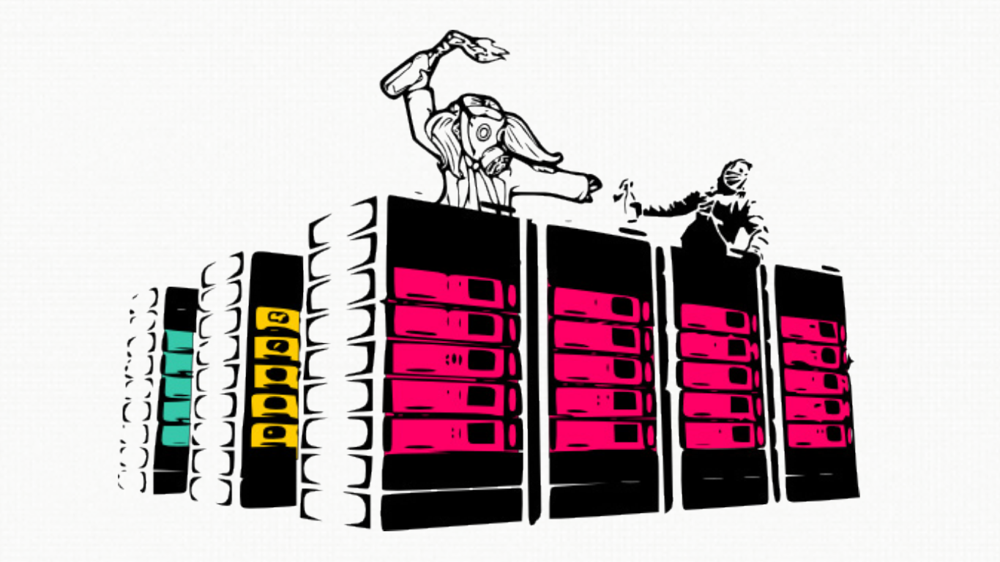
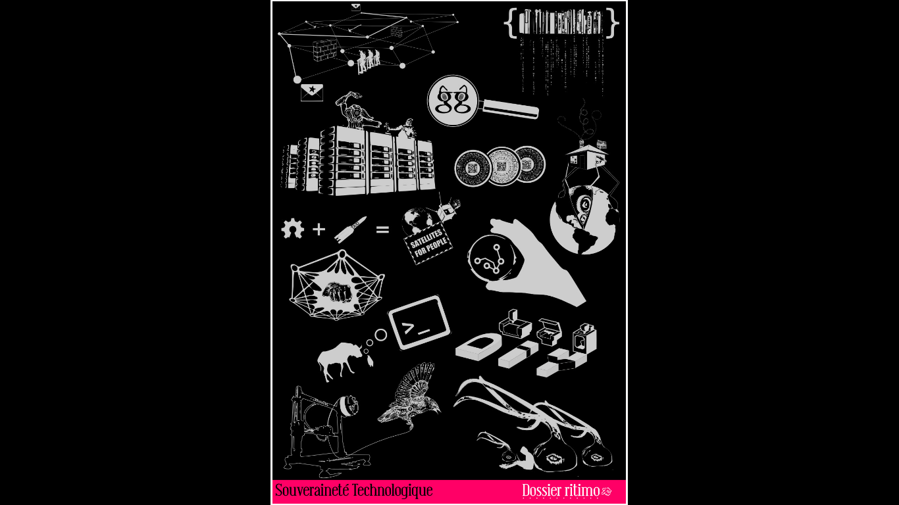
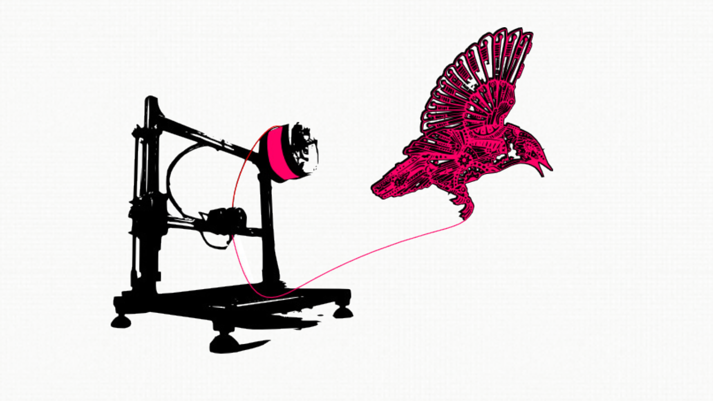
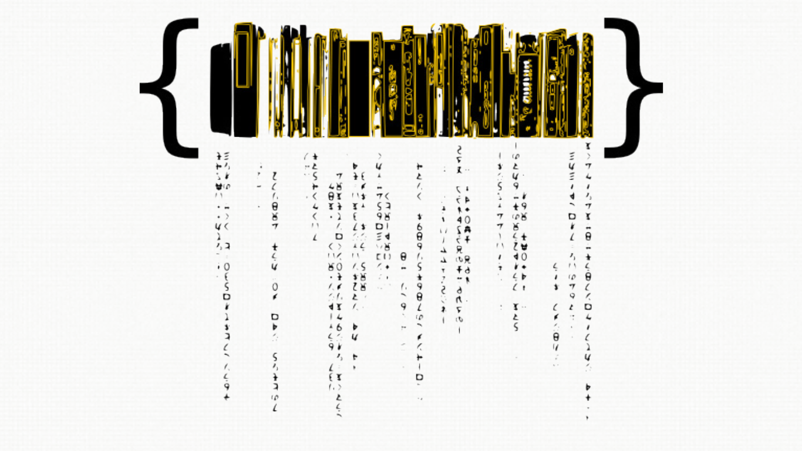
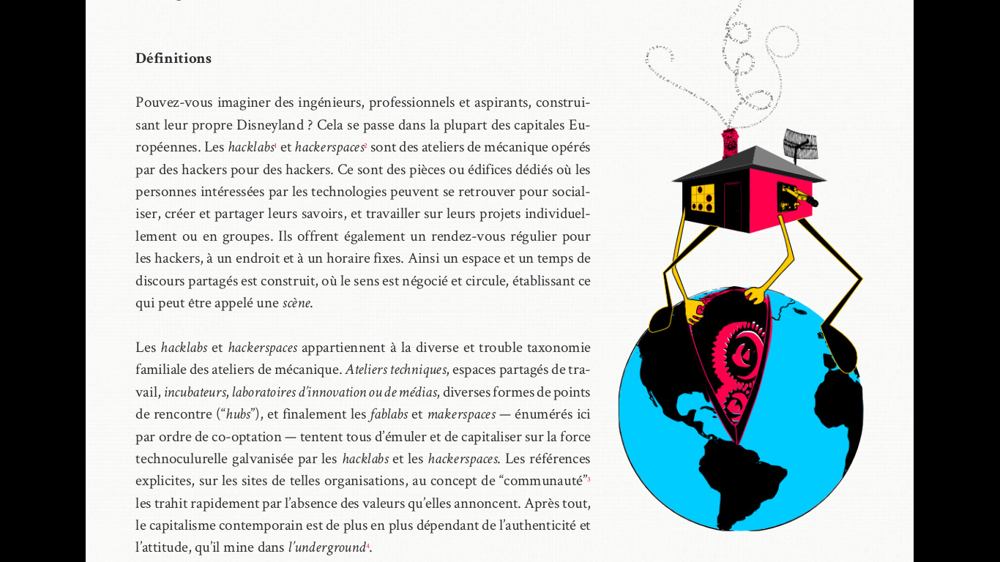

% Technology Sovereignty, Volume #2
% 2017-07-16 15:20-15:40
% maxigas @ hackon, ADM, .nl

##

## 

*“Consumption cooperatives organise themselves in order to establish direct contact with providers, but then, why don’t people self-organise their technological providers, buying the technological support they need directly from them, like carrots?”* — Margarita Padilla

## 

*“Food sovereignty is the right of peoples to **healthy and culturally appropriate** food produced through ecologically sound and sustainable methods, and their right to define own food and agriculture systems.  It puts those who **produce**, **distribute**, and **consume** food at the heart of food systems and policies rather than the demands of the market and corporations.”*   — Via Campesina

## TS Genealogy

 * Via Campesina (1996, 2007): food sovereignty…
 * Margarita Padilla, Spideralex, etc.
 * Calafou, Campamento para la autonomía, Trobada de Comunitats, etc.
 * Barcelona City Council, etc.

## Made in Calafou…

## in collaboration with…

 * Ritimo Foundation, France;
 * hacklabbo, Italy;
 * COATI, Europe;
 * and others.
 
## Technology Sovereignty

 #. Temporality: “Taking your time”
 #. We: “Sovereign”
 #. Responsibility: Five Ws <small>(Who? What? Where? When? How? How much? Why?)</small>
 #. Exchange-based: “Immaterial workers” are compensated
 #. Ecology: Raw materials, labour rights, energy use, etc.

## Book, vol.1

 * **Thematic overview**
 * French, Spanish, Catalan, Italian (new!)
 * SOLD OUT

##

## Book, vol.2

 * **Case studies**
 * French, English, Spanish, Catalan, Italian
 * FORTHCOMING, September 2017

##

## Vol.2: Table of Contents

 * Preface by Margarita Padilla

## Part 1: Initiatives for technology sovereignty

 * Non-destructive algorithms vs. weapons of math destruction
 * Rhyzomatica, community mobile phone network
 * COATI: Simultaneous translation using radio frequencies
 * Leaking platforms
 * Collective of alternative, transparent, open, neutral and solidarity service providers (CHATONS)

## Part 2: Developing the characteristics of technology sovereignty

 * **Encrypting mails with usable tools: Mass adoption of encryption technologies**
 * *Keeping technological sovereignty: The case of IRC*
 * Gamification
 * Appropriate technologies
 * Technology Sovereignty Cooperatives

<!-- ##  -->

<!-- *“Freedom and rights? You have to sweat blood for them! On the Internet, too…”* - Autistici/Inventati -->

## 

## Tool chain

 * Git (git.lattuga.net, 0xacab.org, github, gitlab, …)
 * Markdown (github flavour)
 * GitBook
     + HTML
     + EPUB
     + PDF
     + Plain text repo
 * DTP version with Scribus
 * READ IT, SPREAD IT, FORK IT, TRANSLATE IT!

## Libware

 * Which books there are?
 * How to get printed copies in different places?
 * Who is available to speak about the books?
 * Which events there are?
 * What resources are there, for instance for presentations?

https://gitlab.com/maxigas/libware/

## MOAR books

 * [+Kaos: Ten Years Hacking and Media Activism](https://networkcultures.org/blog/publication/kaos-ten-years-of-hacking-and-media-activism/), originally [+Kaos: 10 anni de mediattivismo e hacking](https://www.autistici.org/who/book#)
 * [Usability in Free Software](http://www.digitigrafo.it/doc/Usability_in_Free_Software/)
 * [Le Guide de Survie TAILS](https://chouettecouetteblog.wordpress.com/)
 * Others?

## MOAR repos

Everything:

 * https://sobtec.gitbooks.io/

Alternative repos:

 * https://github.com/sobteclib/
 * https://gitlab.com/sobteclib/
 * https://0xacab.org/sobteclib/
 
Rendered HTML:

 * https://www.digitigrafo.it/doc/ST/

## 

## Questions?

<small>

Email address:

**maxigas@anargeek.net**

Slides URL:

**https://slides.metatron.ai/technology-sovereignty-vol2/**

Website URL:

**https://relay70.metatron.ai/**

OpenPGP fingerprint:

`FA00 8129 13E9 2617 C614  0901 7879 63BC 287E D166`

</small>

## Bibliography

<small>

