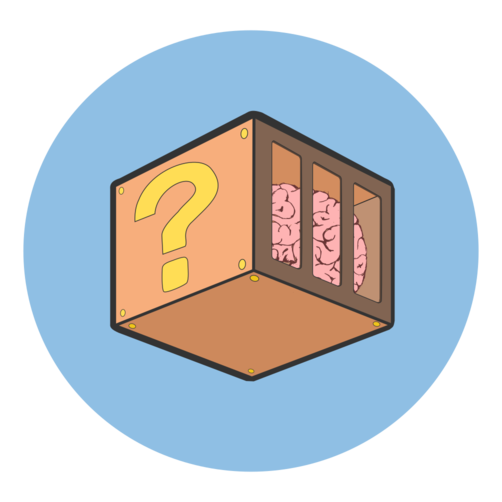

# Digital governance

**Ippolita**

## Once upon a time...

There was a city on the shores of a mountain lake.  The city was very dirty
because people threw the waste in the streets; the water ended up in the lake,
which became polluted and smelly.  More stringent laws were enacted, but
nothing happened despite reprimands and fines; even jail proved
ineffective.  The people had become accustomed to malpractice, they had become
addicted to the stench of open sewers and toxic fumes of burning garbage
heaps.  Every remedy miserably failed.  Those who could not bear the situation
any more had packed up and run – others were simply resigned.  After all, they
thought, that even if they would act as they should, as the others would
continue to misbehave, it was not worth doing anything.

Then, one day, a manager arrived in town.  He proposed to help solve the
situation, but only if the city government entrusted him full powers in the
matter.  If something went wrong, if citizenship complained, they would give
him the heave-ho.  So he obtained a total delegation.  The manager turned
entrepreneur and his technical people put many trash baskets in place and
announced a fantastic waste collection game.  Anyone could participate: just
follow the rules for separate waste collection and you could win amazing
prizes.

It worked so well that after a few months the city was clean.  But now public
transport was in crisis.  Wild parking.  Unsafe roads.  And there was no public
money available.  The manager turned entrepreneur and obtained carte blanche to
handle the other sectors in difficulty.  He had the citizens registered with
full name and address on his social platform.  On it they accounted word for
word what they were doing, and what their friends and acquaintances did, and
people around them.   These and many other actions allowed to enter special
ranks; players who distinguished themselves could level up, and gain access to
new exciting rewards thanks to their statuses.  A sophisticated system made
that you could accumulate credits in the form of digital currency on accounts
managed by the entrepreneur's various companies.  The list of wrongful actions
was continuously updated.  Reporting an illegal action by a neighbour, for
example, entitled the informer to three minutes of free shopping at one of the
entrepreneur's supermarkets; five minutes if it was an information about a
first-time offender.  Digital currency credits replaced traditional money
within the city.  Every interaction could be quantified based on credit, that
you could buy and sell: the entrepreneur's bank took only a small percentage
of each exchange.

The city government was dissolved.  In its place came a technical governance by
the manager, run as a private organization, which resulted in a great saving
in terms of time, money and energy.  The city quickly became a model for the
whole world.  Professionals came from far away to study the miracle.  Everyone
agreed on the most notable feature of the set-up – the true realization of
heaven on earth – that there was no need to think or to choose, since a
magnificent system of notifications was continuously informing all the players
about the next moves to be made in order to gain a reputation.  The few
dissident voices claimed that the players were acting like automatically
pre-programmed machines, but as an initially sceptical citizen confessed, he
finally really felt free for the first time in his life.  No one wanted to go
back to a time when they were in the grip of uncertainty and doubt about what
they should choose.

And so everyone was trained and lived happy thereafter.

## Gamification

This story is meant to illustrate the main elements of “gamification”, one of
the implementation formats of digital governance systems.  Its basic mechanism
is very simple: everything that can be described as a problem is converted
into a game, or, rather, in a game pattern.  Repeating an action deemed correct
is encouraged by way of rewards, credits, access to a higher (hierarchical)
level, publication in charts or records.  Seen from a regulatory point of view,
this means that instead of sanctioning infractions, compliance with the rules
is rewarded.  The outcome is a system of norms which is self-conforming and
positive, with no ethical dimension, since the valuation of any behaviour, its
axiology, is determined by the system, and not by a personal and/or collective
reflection on the action itself.  Gamification stands for the society of
performance [^1].

Loyalty incentives, such as fidelity programs for consumers, for voters, for
subjects, have been known for centuries.  However, the pervasiveness of
interactive digital connection systems opens new scenarios for mass training
techniques.  With it, cognitive delegation morphs into the delegation of social
organization.  Automated interaction procedures are refined by capitalizing on
the way users handle their personal digital tools.  Invidiously, participation
in the construction of shared worlds turns into behavioural drill.

Our intention is obviously not to argue for a return to repressive
systems.   Prohibition and ensuing repression typically triggers a deepening of
the desire for transgression and therefore amounts to a negative reinforcement
mechanism.  Prohibition never works.  Yet, conversely, not all that glitters is
gold with a positive reinforcement system.  Anyone who has dealt with children
knows that rewards are more effective than “teaching them a lesson”.   But then
one often comes to realize that once the kid gets “hooked” to the award they
will want an ever bigger prize, and that there's no way anything is going to
happen unless an even greater accolade can be anticipated.  So often a positive
reinforcement system reverts into a punitive system, which reveals itself as
being merely the opposite of an equivalent system based on rewards.

But education in itself has preciously little to do with compliance with a
given rules, and is has also nothing to do with obedience.  The same old
Socrates, in wanting to educate young people for citizenship by example, did
not only break the rules, but he invited others to be disobedient and follow
their own “Daimon” (daemon, the “inner voice”).  Algorithmic “education” is
nothing else than drill training, and leads to servitude.  Although in
appearance it can produce good results in terms of measurable performance, it
certainly does not induce independence, autonomy or responsibility.

## Pleasure

The line between learning and training is razor thin.  The main factor comes
down to the organic chemical which plays a central role in learning and
responding to positive reinforcement stimuli: dopamine (or more technically
“3,4-dihydroxyphenethylamine”), a neurotransmitter that runs through the
neural paths of our brain.  To simplify what is an extremely complex mechanism,
we can say that the sense of gratification and reward we experience when we
manage to learn something is connected to a release of dopamine.  In general,
the performance of enjoyable activities in the psycho-physiological realm
(drinking, eating, having sex, getting appreciation, empathy, etc.)
corresponds to an increased concentration of this neurotransmitter.  The same
applies, by the way, to the use of drugs.

Learning in all its forms, even in physiological activities, requires effort,
care and attention.  Reading is tiresome, just as is assimilating any new
skill.  To attain a satisfactory level with psycho-physiological activities
requires effort.  The simplest and less costly way to raise the levels of
dopamine and hence to experience pleasure is to complete a task, or to perform
a given procedure, again and again.  Repetition, iteration of a given behaviour
is the formula.  It works as a short-cut.

The emotional development processes take place in the limbic system, the
central and oldest part of the brain.  It indicates the presence or the
prospect of rewards or punishments to promote the activation of motor
programmes aimed at giving pleasure or avoid pain.  Addictive drugs operate
exactly the same way and in the same brain region, causing feelings of
pleasure.  Once established neuronal connections get increasingly strengthened,
thereby losing in plasticity.  This kind of connective stiffening corresponds
to a decreased ability to relax the state of pleasant neuronal excitation
caused by dopamine: in more technical terms, it occurs by way of a long-term
impairment of the synaptic pathways that connect neurons.  Such trails become
like paved roads in our brains, and it takes truckloads of dopamine to feel
pleasure.  At each step, the necessary dose has to be increased.  This explains
why drill is so effective, and why it generates addiction.  The desire for
pleasure related to an automatism, which amounts to compulsive behaviour,
makes us enter into a repetitive loop getting out of which becomes
increasingly difficult because the neural pathways that are always excited,
will not be able to do anything else but get more and more powerful with the
passage of time: beat-rhythm-repetition.

The user touches the device.  Not once, but many times.  From all the touches -
every touch is a beat - comes the rhythm, which is repeated in many
interactions with the device.  Habitual behaviour is manifested in a cycle.

## Give us our game back!

We need to approach the concept of cognitive ergonomics (from ancient Greek
“ergon – nomos”, “rules of the labor”): thanks to the digital media, we can
lower our cognitive load and, for example, and delegate to some device the
task of remembering all the dates and numbers of our agenda.  A very useful
support, kind of indispensable - almost.  We did not need any tuition to be
able to use the phone directory in print.  Or even our telephone for that
matter, or how to manage our contacts on a social platform.  Maybe we had at
times to ask some geek type among our friends.  We probably don't have a clue
how all this stuff works, but the main thing is that we are able to do with it
what we want.  And to do this, we will have to perform a series of repetitive
actions, or retrace a procedure.  We go by what is in the interface and follow
the obvious traces of the algorithmic procedure laid down by others for us.

The organization of our cognitive system is mainly based on intuitive
faculties and reasoning.  Entrusting ourselves to intuition, we only interpret
a context through mental schemes that are already part of our non-conscious
mnemonic luggage.  Cognitive and computational effort is minimal, since we do
not think about what we're doing.  We act automatically.  Reasoning instead
requires substantial cognitive effort, we must dwell on a problem, make
hypotheses, follow a sequence which requires a slow pace and full
involvement.  Intuition allows us to act and to use a tool without being able
to explain its operation, while the reasoning can make us able to explain
exactly how something works without necessary being able to use it.  A virtuosa
violin player may have no idea how her muscles work, but she can use them to
perfection.  Conversely, we may be able to describe the steps to drive a
tractor theoretically by reading a manual, without being able to actually
drive it.

Declarative memory (knowing what, knowing something) is distinct from
procedural memory (knowing how, knowing a procedure).  All the activities we
carry out automatically involve procedural memory.  When we act intuitively we
refer to the procedures we learned in the past, acting out the strategy which
seems the most appropriate for the successful completion of the task at
hand.  We do not need to think.  It is a question of ecology of resources, like
not wasting valuable computational energy to think about how to ride a bike if
you already know how to ride it.  But when there is no match with our previous
experiences, we must refer to reason and analyze environmental conditions
before acting: if a tire is flat, we try to take it apart and fix it.  But if
we can't manage, we have to ask for help, or tinker with it otherwise, and
create a fresh, not yet applied procedure.

In general, using a digital medium, e.g.  a web interface, on an ongoing, daily
basis, means to gradually learn to use it automatically.  And as these
interfaces are designed to give the most user-friendly, intuitive
“experience”, it is easy to see how, through the creation of mental patterns,
one can say that we use them “without thinking”.  Even if we switch to a
different make of cellphone while using the same applications, suffices to
identify its icons to go back to the automatic mode, and type in without
looking at the keypad.

Once trained, the mind is able to repeat one the particular, earlier internal
simulations of the action that we want to complete: intuitive ability is
therefore the ability to simulate a known procedure and acting it out
automatically.  This automatism coincides with the execution of the
procedure.  From there springs most of the apparent misunderstandings regarding
the educational benefits of the use of digital devices, and about cognitive
differences allegedly existing between “digital natives” and later adopters.  A
good illustration is provided by the fact that smartphones and tablets are
used in the rehabilitation of patients suffering from neuro-degenerative
afflictions such as semantic dementia.  In their case, since procedural memory
is the only kind of memory left to them, patients are able to master several
functions and use the devices on a daily basis without problems even though
they are otherwise unable to remember very simple notions.

“Digital natives” is in itself not a very valid concept, people born in the
television age also can become proficient computer users, interact socially
and engage in interpersonal relationships mediated by digital devices, and
find experiencing and participating in multimedia interconnected realities
more interesting than the “disconnected” everyday life.  All moderately
intelligent human beings can become “digital natives”.  A human brain is very
plastic and it modifies itself very quickly when learning procedures, and this
is especially the case with gamification related procedures.  But then, this
does not mean that people are consequently able to comprehend, interpret,
analyze, rewrite or teach the procedural mechanisms they themselves repeat
routinely!

The more or less deep dive into a virtual reality penetrating our organic body
through the optic nerves generates a detachment to our environment and a
selective inattention to non-visual stimuli, as well as being addictive.  And
breaking away from the screen, after passing hours that have seemed to be
minutes, can be felt as a real ache.  Give us the game back, even for a moment,
just a moment, it was so fun! It is such a cool separation from the body.
Here, it is the passage of time which constitutes the fundamental parameter to
identify the different types of interaction.  When we are not aware the passing
of time, we are probably in a phase of flow [^2], of procedural immersion.  We
are living in a current, immediate cycle of interaction, an extremely
addictive experience, which we would like never to end.  When on the contrary
time is perceived as linear, with experiential stages we are aware of, and
which we are able to stratify, to store and to recall later, we find ourselves
in a time of sequential learning and of applying declarative memory.

By now, video games have become a fundamental part of the life of millions of
people, who together spend billions of hours playing on or off-line.  In terms
of turn-over, the video game industry has overtaken all other branches of the
entertainment industry: developing a successful video game, for instance a
MMOG (Massively Multiplayer Online Game), in which participants connect
simultaneously to play in a world that they create together, can be more
expensive, and then turn out to be more profitable, than to produce a
Hollywood blockbuster.  Of course video games are not all the same but the vast
majority are designed to induce flow.  Besides bolstering the dopamine circuit,
they can act on the release of oxytocin, which modulate fear and anxiety and
induces prosocial behaviour, and has an effect on many other neurotransmitters
and hormones.

Many video games are made following the prescriptions of behaviourism, and in
particular the format of the Skinner box game, designed by the American
psychologist Burrhus Frederic Skinner [^3] in his experiments with rats and
pigeons in the 1930s.  Skinner developed a method of learning called operant
conditioning.  A particular type of behaviour will be prompted more
successfully, even in the case of humans, by way of rewards granted in a
non-automatic way.  Thus, a rat will receives food if it presses a button, but
not always.  Training is more effective in that buttons will be pressed down
more frequently if the positive reinforcement is not automatic, but possible
or probable.  A common example with humans is provided by gamblers at slot
machines almost everywhere: players know that they will not always win, if
ever, yet they continue to chip in, because the operant conditioning (“I can
win”) is more powerful than immediate frustration (“I did not win this
time”).  Behavioural training is perhaps the greatest deceit in gamification,
and it is standard to video games and in fact, any other type of game.

The interaction with digital media needs not necessarily to be limited to a
mere self-training, an exercise in procedural memory and simultaneous
intelligence or intuition.  Hacking, the art to “put your hands on”, to take
over the operation of a complex operating system (hard- or software), to tweak
it and alter its functioning at will certainly also appeals to the senses.  Yet
remaining dazed and (not) confused in front of a screen for a classic and self
destructive “flying to Australia” session of 24 hours or more, until the
body/mind collapses of exhaustion is a typical example of system-induced
self-destructive behaviour abusing the self-reinforcing dopamine cycle making
people forget their own organic body.

Thus we strongly aim to and advocate to a conscious and balanced back and
forth between various forms of intelligence and memory.  Care of the self
starts with a careful observation of personal interactions, with listening to
personal inclinations, this with the aim to be able to find the pace to suit
us, and to be able to set our own rules.  In other words, to create our own
interactive “liturgy”.

## From self-defense to hacker convivial pedagogy

We do not want to give up on the game, to give up the pleasure of playing
together.  Indeed, we think that learning by playing is one of the finest ways
to genuinely layer our experiences, to make them part of us.  “Hands on” be our
motto: for the pleasure of tinkering with machines, tweaking devices and
systems, and doing it together, this is is the real joy.  This activity in the
first person, this pleasant interaction (some erotic thrill must be part of
the game!) is a pre-condition of happiness for a hacker playing with
technological tools.

In the course of our “s-gamificazione” workshops (de-gamification) we have
developed a simple methodology to move towards a convivial pedagogy, playing
with the machines we like.  But then, we first have to get rid of the
automatisms that reduce us to mere cogs of the corporate megamachines.  To us,
digital self-defense means above all to drop the habit of re-acting to
gamification stimuli.   As a start we have to change our habits in a conscious
way.

It is not possible here to give an account of a typical workshop, because
there is no such thing as a typical workshop.  In our experience every group of
people and every situation turns out to be radically different from any
other.  Also, very personal issues frequently come to the fore, and it is
essential to keep these within the protected area of the group, away from the
limelight.  Thus we have tried to abstract the basic steps and elements of our
workshops in order to give an account that runs as one and the same story, yet
retold in many different ways.

The first step is to acknowledge the fact that we are immersed in interactive
environments shaped by automatic devices we did not choose and which do not
necessarily make us feel good.

The second step is to observe ourselves acting as if we were strangers, with
weird habits – to look at ourselves in the shape of strange animals waiting
anxiously for that message, getting irritated if it doesn't appear, getting
elated by a like, bouncing when a notification pops up ...

Once we have identified the automatism (stimulus-response) that make us behave
in a certain way, we focus the attention on the emotional changes that result
from them.  Anger, joy, sadness, excitement, impatience, envy, fear and many
other emotions manifest themselves constantly, often in combination.  There
obviously exists an interactive design of emotion of which we are unaware.

The third step is to tell others, to people we trust, what we have discovered
about ourselves, about our behaviours.  This way we are not disclosing facts
about ourselves on public notice boards owned by multinational corporation.  On
the contrary, we choose our own dedicated spaces and times to bring out the
masks that enliven our personal interactive liturgy.  The bundles of emotions
which makes us take the character of an undecided person, or of a braggart, or
of a shy individual, of a competent expert, and of many other possible types
represents what has settled down in our individuality - without us
noticing.  Up to that point the positions “we answer like that” and “we act
like this” - show us how much we have become enslaved to our own induced
behaviors.

Finally, the fourth step is to compare our stories with those of others.  Very
often we find that our compulsive habits are very much similar to those of our
peers, but we also discover that there exists a great many ways to make a
change – as long as we do really want it.

[^1]: “The Performance Society”, in Ippolita, In the Facebook Aquarium, INC, Amsterdam, 2015, p.  23.

[^2]: Flow, or in the zone / in the groove.  See Mihály Csíkszentmihály, Flow: the Psychology of optimal experience, Harper & Row, New York 1990.

[^3]: A brief introduction can be found in S. A. McLeod: Skinner: Operant Conditioning. 2015. https://www.simplypsychology.org/operant-conditioning.html The classic work is B. F. Skinner: Science and human behavior. 1953. http://www.bfskinner.org/newtestsite/wp-content/uploads/2014/02/ScienceHumanBehavior.pdf

