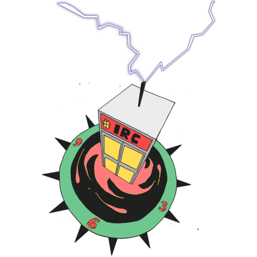

# Keeping technological sovereignty
## The case of Internet Relay Chat

***Maxigas***

**New technologies sometimes manifest a critique of the existing
conditions, but their empowering affordances are often lost as their
features are progressively integrated to the requirements of capitalism
during their subsequent development.** The history of chat devices is a
textbook example of critique and recuperation in technological cycles.
However, the social history and contemporary use of IRC (Internet Relay
Chat) proves that such historical logic can be – and *is* – resisted in
some exceptional cases. This case study does *not* necessarily recommend
IRC as a medium of communication for activists, but rather seeks to put
forward some theses on the history of technology that could be found
useful in certain situations. [^1]

*The systematic study of historical cases may contribute to the
refinement of a taste for critical technology adoption practices in
communities who wish to keep control over the technologies that mediate
their social relations.* An appreciation of critique and recuperation in
technological cycles may help to further technological sovereignty
(Haché 2014) over longer time frames, where local efforts could
potentially become part of capitalist regimes of oppression and
exploitation over time. A corollary observation is that technical
features may result in crucially different technological affordances
depending on their context of use: this shows that pure techniques
should never be promoted or rejected in themselves.

##Internet Relay Chat

**Internet Relay Chat is a very basic but very flexible protocol for
real time written conversations.** It has been first implemented in
1988, one year before the World Wide Web. IRC reached the height of its
popularity as a general purpose social media during the first Gulf War
and the siege of Sarajevo (1992-1996). At this time it performed various
functions that were later fulfilled by specialised programs and
platforms, such as dating, following friends or file sharing. *As the
population of the Internet grew and market consolidation set it on the
turn of the millennium, IRC faded from the public view.*

However, it is known from seminal studies of contemporary peer
production communities that **FLOSS [^2] developers** (Coleman 2012),
**hackerspace members** (Maxigas 2015), **Wikipedia editors** (Broughton
2008) and **Anonymous hacktivists** (Dagdelen 2012) use primarily IRC
for everyday backstage communication. While the first group has always
been on IRC, the latter three adopted it after the apparent demise of
the medium. **“Why these contemporary user groups – widely considered as
disruptive innovators and early adopters – stick to a museological chat
technology despite its obvious limitations within the current
technological landscape?”** Currently popular social networking
platforms, such as Facebook and Twitter, offer similar features and
appear to be a more obvious choice. *I propose that while IRC use can
seem retrograde, it is actually a critical technology adoption practice
that empirically evades, and analytically highlights the pitfalls of
mainstream social media monopolies.*

##Recuperation

*Critique and recuperation in technological cycles* is a process of
integrating societal demands into the capitalist system. New
technologies sometimes embody a demand for a better society and a
critique of the existing conditions. While such demands are typically
addressed by subsequent versions of the same technology, the same
technology is also made to conform to the two main requirements of the
capitalist system. These latter two are *the preservation of social
peace (i.e. repression), and the intensification of exploitation (i.e.
capital accumulation)*. It often happens that the implementation of
these two requirements neutralises the societal gains from the demand
originally associated with the technology.

One aspect or form of recuperation is *commodification*. Commodification
is when something at some point becomes a commodity to be brought and
sold on the market. Commodification targets *authentic* things, which
are often already perceived to be valuable – for instance as a moral
good – but not yet recognised as an object of monetary exchange. The
loss of authenticity through commodification produces *anxiety* in
consumers, which can be diagnosed as the affective trace of capital’s
violence.

<!-- To summarise, *critique* addresses a social problem as a demand.  *Recuperation* is the implementation of the demand, but in the same movement also the transformation of the technological context in a way that neutralises the critique.  The requirements that the implementation of the demand has to paradoxically fulfil are (a.) keeping *social peace* (repression) constant while (b.) increasing *exploitation* (capital accumulation).  *Commodification* is an aspect or mode of recuperation that often happens in technological cycles.  Commodification targets *authentic* goods which are outside of the market, and integrates them into the circulation of commodities.  *Anxiety* is the byproduct of commodification as the affective trace of capital’s violence. -->
Histories
=========

**Recuperation as a historical logic can be seen at work in a wide range
of technologies, from the history of chat to the development of personal
computing.** The personal computer was the material expression – or
functional implementation – of countercultural ideals of personal
freedom in the 1970s (Markoff 2005; Turner 2006; Zandbergen 2011). The
first PCs were constructed by hobbyists, most famously around the
Homebrew Computer Club, but just as well by their counterparts in less
hyped places such as Yugoslavia by people like Voja Antonić (Antonić
2014). Their ideal of *general computing* for everybody was realised to
a considerable extent in rich countries, where PCs became available on
the civilian market as household goods in the 1980s. Companies whose
CEOs sometimes grew up in the Homebrew scene, such as Apple Inc. and the
Microsoft Corporation lead this transformation, with considerable
support from governments who were convinced by the revolutionary myth of
computing legitimised by counterculturalist visions. PCs were
interconnected through open standards to form the Internet. While in the
1990s few users built their own hardware any more, FLOSS allowed full
control over their software.

The history of the next cycle of personal communication devices – the
mobile phones – is in contrast a purely corporate history, culminating
in the smartphone. The smartphone, in turn, is far removed from the
ideal of user-controlled general computing. Mobile networks are based on
protocols whose details are trade secrets; SIM cards which run an
operating system remotely controlled by the vendor, and even the popular
Android FLOSS ecosystem is tightly coupled to Google Inc. services.
While mobiles reach 100% of the global population and thus realised the
demand of personal computing for everyone (IANS 2013), the ideals of
general computing and user control that provided the rationale for
personal computing have been inversed (Doctorow 2011).

**Chat devices** answered a basic human need to discuss arbitrary topics
informally in a real time environment, in a coffee-house public manner
where strangers can band together but there is also possibility for
one-to-one private conversations. After a long and parallel history of
chat devices, in the 1990s they consolidated into IRC. The next
generation of chat devices were *Instant Messengers* (Maxigas 2014). On
the backend (Stalder 2013), IMs used proprietary protocols and
centralised infrastructures, instead of the community defined protocols
of IRC and its federated model. On the frontend (Stalder 2013), IMs were
organised around private conversations, in stark contrast with IRC’s
concept of topical channels (itself taken from Citizens’ Band – CB –
radio). Later, as the World Wide Web took off, chat features were
integrated into Web 2.0 *social media platforms*.

Eventually, *surveillance* came to be the key means for both maintaining
social peace and deepening exploitation on social media platforms. [^3]
Everyday, informal, even intimate gestures are captured and stored,
sorted and mined for the purposes of both targeted advertising and
targeted repression. Such revenue is indispensable to the capital
accumulation mechanisms of a growing section of capital, while the
intelligence gained by authorities who share access to the information
flows is essential to the maintenance of social order in both
dictatorships *and* democracies. For instance, surveillance –
technically based on the analysis of log files – accounted for 89% of
Google’s profit in 2014 (Griffith 2015). [^4] All this hinges on
successful *platformisation*: the ability of a vendor to install
themselves as an obligatory passage point for generally mundane and
often minuscule social interactions (Gillespie 2010). The kind of
digital milieus where average Internet users chit-chat nowadays have
been variously described by scholars as *enclosures*, *walled gardens*
and *social media monopolies* (Lovink and Rasch 2013).

The anxiety experienced by users stems from the fact that a supposedly
informal space of social interaction is mediated by capital and overseen
by the state, through mechanisms that seem obscure, arbitrary and
partial from below. One can remember that the two defining
characteristics of a healthy *civil society* that can support
technological sovereignty are its independence from capital and
separation from the state (Haché 2014). It is *privacy* in a structural
and collective sense that can be reclaimed through technological
sovereignty initiatives, but only through the continuous struggle of
users for taking the technological mediation of their social life into
their own hands.

Notably, neither chat (Latzko-Toth 2010) nor personal computing (Levy
1984) were “inventions” in the sense that a good idea was implemented
and socialised through commodity circulation. Both found a foothold in
the market only after a relatively long period where fringe elements
fought for them, often breaking existing laws, regulations and social
norms. Society then slowly tamed these technologies – and now they are
used to pacify society itself.

##Backlogs

**Logs are consecutive lines of texts that record events and
interactions, from logging in a service to a piece of conversation
between hitting the Send button.**

###As a Human-Computer Interaction limitation

*IRC is different from many other chat devices in that users can only
follow conversations as long as they are logged in.* If a particular
user is not online, there is no way to contact her. Conversely, when a
user logs back to a channel, she has no idea what she missed while she
was offline. Due to the flexibility of the medium, there are many
workarounds for the lack of backlogs, but the fundamental fact remains
that solving this problem is out of scope of the IRC protocol. Network
operators could solve the problem if they wanted, but in practice users
are – literally – left to their own devices.

###As a classic affordance

When IRC was conceived (1988), the lack of backlogs was not a
particularly unique property of IRC. The feature was absent from several
other chat devices. However, by the end of the decade it took on a
particular significance. **The lack of backlogs allowed IRC to keep up
with the radical increase of Internet users and *become a mass media of
its own***. In the 1990s IRC was the most popular dating application
before dating websites went online, music sharing software before the
rise and fall of Napster, [^5] and micro-blogging service before Twitter
cashed in on hashtags. Users saw nothing geeky or techie in IRC: it was
as quotidian as the ubiquitous GeoCities [^6] home pages.

In the beginning of the 1990s it was usual practice for the Internet
community to run popular services on a volunteer basis, or for
institutions to contribute to the running costs of public
infrastructures. However, by the end of the decade the dot-com
bubble [^7] was in full swing and users flooded the networks, so that
operating media comparable to the popularity of IRC was serious
business. While purveyors of various other services had to look for a
business model in order to ensure the sustainability of their
operations, IRC operators did not need to commodify their services. Why?

Because keeping track of backlogs for each user would mean that resource
utilisation scaled exponentially with the number of users, whereas if
the server only broadcasts new lines as they arrive and then forgets
about them, connecting more users results in little overhead. This is
more or less true for both processing power and storage capacity: the
two essential computing costs to be taken into account when operating
services. Similarly, keeping backlogs would increase the complexity of
server software, translating into increased costs in terms of
development and administration work hours.

How these factors played out historically was that workers at Internet
Service Providers or academic outlets could just let a spare server
running in the corner, without having to justify the expenses to funders
or answering too many questions from their superiors. Under-the-counter
IRC hosting can be thought of as the détournement of fixed capital by
users, rather than the recuperation of users’ demands by capital.

An anecdote illustrates the relationship of IRC to the burgeoning IT
industry. It was already 1996 when Microsoft included an IRC client in the
default installation of its popular Windows operating system, taking note of
IRC’s mainstream appeal. (Kurlander, Skelly, and Salesin 1996) In the first
major attempt to recuperate IRC, the software was developed by the company’s
Artificial Intelligence research unit, and the application connected
automatically to the company’s own IRC servers. (Latzko-Toth 2010) Ironically,
the Comic Chat IRC interface was never popular with users, and the only
artifact that went down in history from the whole enterprise was the Comic
Sans font, which is still the laughing stock of Internet users. Microsoft
never figured out how to make money from the largest online chat phenomena of
the time.

IRC networks have no corporate overlords. Instead, they are made up of
federated servers run by otherwise unconnected actors, from individual
geeks through academic institutions to IT companies or even criminal
organisations. So much so, that upon logging in to a mainstream IRC
network today, it is actually hard to find out who is sponsoring the
resources behind the server. The model of Internet-wise, community-run,
community-policed and community-developed communication resources may
seem atavistic today, when even starry-eyed activists think that it is
impossible to change the world without becoming entrepreneurs and
finding a “sustainable” business model. However, running the
infrastructure as a commons works for IRC just as well as in the 1990s.
It allows users to understand and control the media they use to share
and collaborate: an essential condition for nurturing *technological
sovereignty*.

###As a modern affordance

**The same feature that allowed IRC to become a mass media in the 1990s
actually *prevents its from mainstream adoption in the 2010s***. Users
dropping into a channel, asking a question, then leaving in frustration
20 minutes later are a case in point. These *lamers* living in the age
of mobile connectivity cannot keep their IRC clients logged in for hours
on end, like the owners of desktop computers once did, and IRC users who
have access to always-on servers do today. Now, only relatively
sophisticated users get the full IRC experience, and feel part of the
chat channels community. Such elitism excludes less motivated users, but
keeps the conversation within active members of peer production
communities.

FLOSS developers, Anonymous hacktivists, Wikipedia editors and
hackerspace members adopted IRC as their backstage communication
channels. By now it is the only contemporary chat device on the Internet
that allows informal, largely public, topic-centric discussions in a
non-commercial environment free of state oversight and corporate
exploitation. These criteria are paramount to groups that work together
to produce for the common good and which deal with sensitive topics. Of
course, topical, public, informal discussions were the original demand
behind the popularity of chat devices.

However, through three cycles, features and affordances shifted towards
personal conversations with people that you already know, while even
group chat features came to be tightly coupled to surveillance. Chat
devices are available for all today, yet historical changes undermined
the original demands and the social critique that saw chat as a place
for congregation and collaboration free from the interference of the
state and capital. In light of these developments, the lack of backlogs
– that makes surveillance technically complicated – came to mean a very
different thing: it still protected the *technological sovereignty* of
user groups, but only those that invested time and energy to hold on to
it.

<!-- user groups! -->
###Conclusions

**It seems that technical deficiencies can have positive social
consequences**. The same limitation – the lack of backlogs – that
allowed IRC to become a mass media in the 1990s, prevents its mass
adoption in the 2010s. However, it also poses problems for data mining
and surveillance, which eventually forestalls its recuperation. As a
user-controlled technology, it now plays an important part in the media
ecology of the Internet, as the everyday backstage communication
platform for peer production communities.

These relatively sophisticated user groups benefit from the simplicity,
flexibility and open architecture of the medium, which allows them to
customise it to their needs. Conversely, most Internet users are used to
be served by corporate social media platforms that cater to their needs
effortlessly. The contrast between the two approaches to technology
adoption begs the question **whether it is more desirable to work for
the democratisation of knowledge or merely the democratisation of
technology**.

*The lack of backlogs helped to build technological sovereignty for
Internet users for a decade and later sheltered peer producers from the
capitalist requirements of exploitation and repression.* Those who cared
about IRC had to navigate a terrain of changing social conditions –
including rifts in the technological landscape and paradigm shifts in
political economy – which recontextualised the significance of technical
features and limitations. The contemporary use of IRC is based on
properties and patterns of the medium that were commonplace in the 1990s
but were superseded by more capitalist media since then. Therefore, it
can be conceptualised as a *time machine* which brings past
technological and political conditions to the present, with surprising
consequences. [^8]

###Bibliography

Antonić, Voja. 2014. “Voja Antonic in Calafou.” Talk at Calafou.  https://calafou.org/en/content/voja-antonic-calafou>.

Bango, Rey. 2013. “IRC Is Back: Here’s Your Starter Guide.” Online tutorial.  <https://code.tutsplus.com/tutorials/irc-is-back-heres-your-starter-guide--net-31369>.

Beritelli, Laura, ed. 2017. *+Kaos: Ten Years Hacking and Media Activism*. Amsterdam: Institute for Network Cultures.  <https://networkcultures.org/blog/publication/kaos-ten-years-of-hacking-and-media-activism/>.

Broughton, John. 2008. *Wikipedia: The Missing Manual*. 1st ed. O’Reilly Media.

Coleman, Gabriella. 2012. *Coding Freedom: The Ethics and Aesthetics of Hacking*. Princeton: Princeton University Press.

Dagdelen, Demet. 2012. “Anonymous, Wikileaks and Operation Payback: A Path to Political Action Through Irc and Twitter.” Paper presented at the IPP2012: Big Data, Big Challenges?, Oxford Internet Institute, Oxford, UK.  <http://ipp.oii.ox.ac.uk/sites/ipp.oii.ox.ac.uk/files/documents/Dagdelen2.pdf>.

Doctorow, Cory. 2011. “The Coming War on General Computation.” Talk at 29C3, The 29th Chaos Communication Congress.  <http://events.ccc.de/congress/2011/Fahrplan/events/4848.en.html>.

Fuchs, Christian. 2012. “Google Capitalism.” *TripleC: Cognition, Communication, Co-Operation* 10 (1): 42–48.

Gillespie, Tarleton. 2010. “The Politics of ‘Platforms’.” *New Media & Society* 12 (3): 347–364.  doi:[10.1177/1461444809342738](https://doi.org/10.1177/1461444809342738).

Griffith, Erin. 2015. “Bad News for Google Parent Alphabet: The ‘G’ Will Still Foot the Bill.” Article in Forbes Magazine.  <http://fortune.com/2015/08/10/google-ads-money/>.

Haché, Alex. 2014. “Technological Sovereignty.” *Passarelle* 11 (11): 165–171. <http://www.coredem.info/rubrique48.html>.

IANS. 2013. “There Will Be More Mobile Phones Than People by 2014: ITU.”  News article in the Deccan Herald.  <http://www.deccanherald.com/content/332274/there-more-mobile-phones-people.html>.

Internet Archive. 2009. “GeoCities Special Collection 2009: Saving a Historical Record of Geocities.” Web page.  <https://archive.org/web/geocities.php>.

Ippolita. 2015. *The Facebook Aquarium: The Resistible Rise of Anarcho-Capitalism*. Revised and updated English edition. 15. Amsterdam: Institute for Network Cultures.  <http://networkcultures.org/blog/publication/no-15-in-the-facebook-aquarium-the-resistible-rise-of-anarcho-capitalism-ippolita/>.

Kurlander, David, Tim Skelly, and David Salesin. 1996. “Comic Chat.” In *SIGGRAPH ’96: Proceedings of the 23rd Annual Conference on Computer Graphics and Interactive Techniques*, ed by. John Fujii, 225–236. New York: ACM; ACM.  doi:[10.1145/237170.237260](https://doi.org/10.1145/237170.237260).  <https://sci-hub.io/10.1145/237170.237260>.

Latzko-Toth, Guillaume. 2010. “Metaphors of Synchrony: Emergence Differentiation of Online Chat Devices.” *Bulletin of Science, Technology & Society* 30 (5): 362–374.  doi:[10.1177/0270467610380005](https://doi.org/10.1177/0270467610380005).  <http://bst.sagepub.com/content/30/5/362.short>.

Levy, Steven. 1984. *Hackers: Heroes of the Computer Revolution*. Anchor Press, Doubleday.

Lovink, Geert, and Miriam Rasch. 2013. *Unlike Us Reader: Social Media Monopolies and Their Alternatives*. INC Reader \#8. Institute of Network Cultures.  <http://networkcultures.org/blog/publication/unlike-us-reader-social-media-monopolies-and-their-alternatives/>.

Markoff, John. 2005. *What the Dormouse Said: How the Sixties Counter Culture Shaped the Personal Computer Industry*. London: Penguin.  <http://libgen.io/book/index.php?md5=631E8A3A67AB0EA19ECD3DB0E689ADA1>.

Maxigas. 2014. “History of Real Time Chat Protocols.” *Relay\#70 Panel F* (February).  <http://relay70.metatron.ai/history-of-real-time-chat-protocols.html>.

———. 2015. “Peer Production of Open Hardware: Unfinished Artefacts and Architectures in the Hackerspaces.” Doctoral dissertation, Barcelona: Universitat Oberta de Catalunya, Internet Interdisciplinary Institute.  <https://relay70.metatron.ai/maxigas_dissertation.pdf>.

Stalder, Felix. 2013. “Between Democracy and Spectacle: The Front and the Back of the Social Web.” In *Unlike Us Reader: Social Media Monopolies and Their Alternatives*, ed by. Geert Lovink and Miriam Rasch. INC Reader \#8. Amsterdam: Institute of Network Cultures.  <http://felix.openflows.com/node/223>.

Turner, Fred. 2006. *From Counterculture to Cyberculture: Stewart Brand, the Whole Earth Network, and the Rise of Digital Utopianism*. First edition. Chicago: University of Chicago Press.  <http://libgen.io/book/index.php?md5=6916B53A2F276602174090943602E3F2>.

Zandbergen, Dorien. 2011. “New Edge: Technology and Spirituality in the San Francisco Bay Area.” Dissertation, Leiden: University of Leiden.  <https://openaccess.leidenuniv.nl/handle/1887/17671>.

[^1]: A gentle introduction is Bango (2013), while activists may find Beritelli (2017) useful for a jump start.

[^2]: Free and Open Source Software.

[^3]: “The legacy of the 20th century has accustomed us to think that social control pertains only to the political, but it has long since become primarily an economic question of commercial implications. It is no coincidence that the NSA has made use of the collaboration with Microsoft, Yahoo, Google, Facebook, Apple and so on, to obtain data for the surveillance program PRISM.” (Ippolita 2015, 7)

[^4]: “Google is a profit-oriented, advertising-financed moneymaking machine that turns users and their data into a commodity.” (Fuchs 2012, 47)

[^5]: The software and company that brought peer-to-peer file sharing into the limelight and folded after a much publicised copyright controversy (1999-2002).

[^6]: Popular free web hosting service (1994-2009) that allowed users to upload their own websites: “an important outlet for personal expression on the Web for almost 15 years” according to the Internet Archive (2009).

[^7]: A speculative investment bubble (1996-2001) inflated by the growth of the World Wide Web and burst because it was not clear how companies offering online services could turn a profit on traffic.

[^8]: With the support of a postdoctoral grant from the Universitat Oberta de Catalunya (UOC) and the sponsorship of the Central European University Foundation, Budapest (CEUBPF) for a fellowship at the Center for Media, Data and Society in the School of Public Policy.
