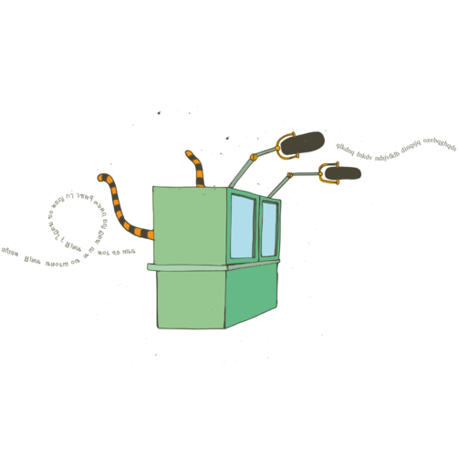

# Interpretación simultánea transmitida por radiofrecuencia

***Colectivo para la Autogestión de las Tecnologías de la Interpretación***

> *«Ni la solidaridad internacional ni las protestas globales son fenómenos
> nuevos. Desde las revoluciones europeas de 1848, pasando por las revueltas
> de 1917-18 tras la revolución rusa, hasta los destellos de resistencia casi
> universales en 1968, las luchas siempre han sabido inspirarse mutuamente y
> comunicarse a nivel global. Lo que quizás sí sea novedad en nuestros tiempos
> es la facilidad y rapidez con las que podemos comunicarnos de una lucha a
> otra, y el que la globalización ha supuesto que personas muy diversas
> pertenecientes a culturas distintas de todo el planeta tengan ahora un
> enemigo en común.»* — Do or Die, número 8, 1999

> *«Nuestra resistencia es tan transnacional como el capital»*  — Lema del
> día de acción global contra el capitalismo, 8 de junio de 1999

A medida que la economía se ha ido volviendo más transnacional, también
lo ha hecho la resistencia contra sus devastadoras consecuencias
sociales y ecológicas. La resistencia internacional requiere el
encuentro de luchas y culturas distintas para conocernos, compartir
ideas y experiencias, y coordinar acciones. Este cruce de fronteras y
culturas implica también el cruce de barreras lingüísticas. Y las
cuestiones lingüísticas afectan a las relaciones de poder.

Muchas reuniones internacionales se llevan a cabo en las lenguas más
«internacionales», como el inglés, español, ruso o francés. Mucha gente
habla estos idiomas, pero eso se debe a su largo historial imperialista:
fueron impuestas por la fuerza, a menudo, de manera brutal a pueblos de
culturas muy diversas, al tiempo que arrasaban las lenguas locales y
borraban la diversidad cultural. Nos pueden ser útiles para
comunicarnos, pero, a menudo, no son nuestro primer idioma y quienes
participan en una reunión en lengua extranjera pueden no tener claro si
han entendido todo bien, o pueden inhibirse a la hora de hablar por
falta de confianza en su capacidad de expresión. Estas reuniones por
tanto, con frecuencia, acaban dominadas por quienes se sienten a gusto
con una lengua mayoritaria; de este modo los hablantes nativos de las
lenguas coloniales (especialmente el inglés) han dominado la historia y
siguen dominando nuestras reuniones.

Si de verdad estamos a favor de la diversidad, la participación de base
y la toma de decisiones por consenso, debemos concienciarnos de estas
relaciones de poder y procesos de inclusión y exclusión. El aumento de
la igualdad en nuestras comunicaciones y el abrir espacio para hablantes
de otras lenguas es una tarea política importante, y una de las
herramientas más útiles en este sentido es la interpretación, para que
cada persona pueda hablar un idioma en el que se pueda expresar sin
dificultades.

La interpretación entre dos lenguas es un arte tan antiguo como las
lenguas mismas, y no exige el uso de tecnología ninguna. Sin embargo,
para que la interpretación sea practicable en reuniones multilingües
debe ser simultánea; y la interpretación simultánea multilingüe no se
puede hacer sin tecnología.

## Historia de las tecnologías de interpretación alternativas

Los primeros intentos de utilizar medios tecnológicos para facilitar este tipo
de interpretación se remontan a los juicios de Nuremberg tras la Segunda
Guerra Mundial, con un sistema basado en la telefonía [^1]. Desde aquellos
comienzos, la tecnología, por lo general basada en transmisión por
infrarrojos, ha ido desarrollándose a la par que organizaciones
internacionales como la ONU y la Unión Europea. Hoy é,stas usan tecnologías
muy maduras pero extremadamente caras, y por tanto, fuera del alcance de la
mayoría de espacios activistas y movimientos sociales.  A veces para una
reunión se puede alquilar algún de equipo de éstas características, pero
cuando queremos trabajar a una escala más ambiciosa los costes se vuelven
prohibitivos.

Los Foros Sociales Europeo y Mundial (FSE y FSM), que se realizaron
entre 2001 y 2010, fueron actos internacionales que llegaron a contar
con más de 100 000 participantes y más de cien reuniones en paralelo,
cada día. En un principio, la interpretación debido a su alto coste
estuvo muy limitada, pero algunas personas tomaron conciencia de la
importancia que tienen los idiomas en el proceso político, y fue así
como nació Babels, una red de intérpretes voluntarias.

La interpretación resulta más sencilla en las grandes sesiones
plenarias, donde sólo unas pocas personas hablan y la mayoría se limita
a escuchar. El trabajo participativo requiere grupos más pequeños, en
los que más gente pueda contribuir, pero conlleva que se multipliquen
los recursos necesarios para la interpretación. Por tanto, las
decisiones que se toman sobre la interpretación afectan los modos de
trabajo que se dan en una reunión. El coste prohibitivo de las
tecnologías comerciales e intérpretes pone límites a los recursos
disponibles para el trabajo de fondo: por ello, no existen las
decisiones puramente técnicas. Y aunque hubiese dinero para contratar un
servicio de traducción, este representaría un gasto a fondo perdido.
Cuando le das el dinero a una empresa privada, esos recursos
desaparecen. La alternativa es la autogestión, invertir esos recursos en
personas y materiales de modo que sirvan para aumentar las capacidades y
la autonomía de los movimientos.

En el FSE de París en 2003 más de 1000 voluntarias contribuyeron a la
interpretación, de modo que todas las plenarias y talleres tuvieron
lugar en varios idiomas. Sin embargo, la tecnología que se usó era
comercial, y los costes resultaron astronómicos. Nunca más se volvió a
usar tecnologías de interpretación comercial en una reunión de este
tamaño. Ese mismo FSE inspiró unos primeros experimentos con tecnologías
alternativas para la interpretación. Al principio, se probó con
ordenadores, pero la digitalización alargaba los desfases temporales
entre lo que se decía y su traducción, lo que llevaba a la confusión
tanto de las intérpretes como del público.

En el FSM de Mumbai en 2004, se optó por una tecnología más asequible,
analógica, con transmisión por cable y por ondas de radio FM. En el FSE
de 2006, en Grecia, se formó el colectivo ALIS (ALternative Interpreting
Systems) para proporcionar tecnología de interpretación. Aprovechando la
experiencia y los esquemas electrónicos de los grupos que habían estado
usando consolas de interpretación analógicas y transmisión por radio FM.
Se dedicaron meses de trabajo a fabricar materiales suficientes para
cubrir el foro entero.

Atenas fue la primera vez (y en el marco de los Foros Sociales, por
desgracia la última) en que un encuentro político de tal envergadura
reconoció plenamente la categoría política de la tecnología de
interpretación alternativa, y le dedicó el espacio y los recursos
necesarios para que llevase a cabo su misión. El resultado fue un éxito
sin precedentes. Los receptores de infrarrojos son aparatos muy caros,
custodiados celosamente por sus dueños que exigen a los participantes
que depositen para su uso un pasaporte o tarjeta de crédito a modo de
fianza; en Atenas, sin embargo, podía hacer uso de la interpretación
cualquiera que tuviese un transistor FM. A día de hoy, los movimientos
sociales siguen utilizando distintas versiones de ese mismo sistema,
permitiendo a cualquiera escuchar la interpretación con una simple radio
de bolsillo o un teléfono con receptor de radio.

No obstante, el resultado de trabajar con los Foros Sociales ha sido de
mostrar que la falta de apoyo político y material en los eventos ha
vuelto inútiles todos los esfuerzos de técnicos e intérpretes. Además,
entre un evento y otro, cuando había que ocuparse de comprar, fabricar,
almacenar, transportar, probar y reparar el equipo, no existía ningún
apoyo para esa labor. A diferencia del equipo comercial, que se alquila
para los días del evento, el equipo autogestionado es algo de lo que te
tienes que encargar entre las reuniones, y a veces, en cantidades
mayores a las que puedas necesitar para un evento concreto. Hay que
formar gente para su uso, hay problemas logísticos que resolver y cargas
administrativas, y todo esto requiere recursos y dedicación. Aunque los
Foros Sociales se negaron a entender todo esto, otros movimientos sí lo
han entendido.

## COATI: El Colectivo para la Autogestión de las Tecnologías de la Interpretación

COATI se formó en Barcelona en 2009, reuniendo a personas que habían
participado en movimientos anticapitalistas y antiglobalización.
Habíamos apoyado a lxs campesinxs de La Vía Campesina en la creación del
movimiento por la Soberanía Alimentaria, habíamos trabajado de
intérpretes voluntarias (a veces en condiciones muy precarias) y
entendíamos el valor de una tecnología alternativa de calidad. Habíamos
aprendido a organizarnos de forma horizontal y consensuada en la cultura
DIY de los centros sociales anarquistas y anticapitalistas de toda
Europa. Teníamos experiencia de la tecnología gracias a los *hacklabs*
okupas y las comunidades de software libre. Aprendimos el uso de los
sistemas de sonido organizando festivales de punk hardcore, fiestas
callejeras y radios comunitarias independientes. Todas estas
experiencias, y los valores que animan a estas comunidades, inspiraron
nuestro proyecto.

Invitamos a un miembro del Colectivo ALIS para que viniese a Barcelona y
nos enseñase cómo funcionaba su equipo. Así, empezamos la búsqueda de
toda esa vieja tecnología alternativa (la mayor parte de la cual estaba
apilada en almacenes u olvidada en cajas en las oficinas de alguna
campaña, cubriéndose de polvo). Nuestro compromiso era aumentar la
diversidad lingüística y nuestro plan adquirir y gestionar el equipo,
para que cada evento no se viese obligado a solucionar el problema
tecnológico empezando de cero cada vez. Sin embargo, pronto vimos que el
aumentar el acceso a la tecnología de la interpretación iba a exigir más
que simplemente gestionar el material y reducir los costes.

### Hacer que la tecnología alternativa sirva a la gente

El primer reto fue superar las resistencias al uso de tecnologías
alternativas, causadas por experiencias negativas anteriores. El sistema
diseñado por los movimientos sociales no tenía la misma calidad que el
equipo comercial. Se fabricó con el objetivo de reducir, de manera
significativa, los costes, utilizando materiales baratos no diseñados
específicamente para procesar señales de sonido. Eso significaba, a
veces, que tanto lxs intérpretes como el público tenían que soportar un
zumbido electrónico que en breve resultaba agotador.

Un elemento importante de la solución fue el de otorgar a la tecnología
su importancia. Nos formamos, y adonde fuera nuestro equipo siempre
estaba una persona responsable y dedicada a su manejo, ya que muchos de
los problemas provenían de que de la tecnología se preparaba en el
último momento, y no había nadie encargadx de que funcionase bien.
Aprendimos, manos a la obra, y dedicamos mucho tiempo a encontrar las
causas de los problemas y a modificar el equipo, añadiendo pequeños
circuitos para filtrar y amplificar señales y mejorar la calidad del
sonido.

Nos dificultó mucho esta tarea el hecho que el equipo que fabricó el
colectivo griego no venía con esquemas electrónicos. Por ello, hicieron
falta muchas horas de ingeniería inversa antes de poder comenzar con las
modificaciones. Hoy este equipo ya tiene casi diez años y empezamos a
plantearnos el reto de diseñar y fabricar, partiendo de cero, nuevas
consolas de «código abierto». Somos muy conscientes del valor que tiene
el código abierto, por lo que, el resultado de todo nuestro trabajo
electrónico está plenamente documentado y disponible en línea.

### Hacer que la gente se sirva de la tecnología alternativa

Solventar los problemas técnicos no fue nuestro único reto. Algunas de
las peores dificultades venían de las culturas políticas y organizativas
de los propios movimientos. Muchos grupos se basan en un modelo
organizativo relativamente informal, y muestran resistencia ante la
disciplina requerida para la interpretación simultánea: hay que
expresarse de manera clara y despacio; hablar en el micrófono para que
la señal llegue a lxs intérpretes; y lxs participantes no pueden estar
interrumpiéndose mutuamente. Algunas grandes redes y ONG, a veces, sí
tienen experiencia de trabajar con intérpretes, pero tienden a verlos
como un mero servicio técnico que debería ser invisible, en lugar de un
elemento importante del proceso político. Las exigencias de
participación política por parte de las iniciativas de interpretación
solidaria con tecnologías alternativas les causan frustración. Además,
por muy bien que funcione la tecnología, el mero hecho de que haya
interpretación no elimina automáticamente las relaciones de poder
creadas por los idiomas; y sigue siendo responsabilidad de todxs crear
espacio para incluir más lenguas minoritarias.

Por lo tanto, otro aspecto importante del trabajo de COATI ha sido
fomentar la cultura política necesaria para que la tecnología de
interpretación alternativa pueda funcionar de verdad.

### Interpretación voluntaria

La tecnología alternativa puede ser utilizada también por intérpretes
pagadxs, e intérpretes voluntarixs pueden trabajar en cabinas
comerciales. Los dos procesos se han ido desarrollando a la par, y un
elemento clave de la organización de un acto internacional consiste, a
menudo, en la búsqueda de voluntarixs capaces de cubrir las necesidades
lingüísticas. Por ejemplo, se pueden encontrar intérpretes profesionales
dispuestxs a trabajar gratis, por solidaridad, por acumular experiencia,
o porque así pueden viajar con gastos pagados a lugares exóticos. Sin
embargo, las relaciones que así se crean corren el riesgo de quedarse en
la provisión de servicios baratos, con voluntarixs que tienen poco
interés en las cuestiones políticas de las que se habla. Además, los
gastos pueden seguir siendo muy elevados aunque el trabajo se haga
gratis.

Por ello, gran parte de nuestra labor consiste en apoyar los movimientos
a construir su capacidad para la interpretación simultánea a partir de
sus propias bases. Cuanto mayor sea un evento, más complejo será este
proceso y se podría escribir otro artículo sólo sobre las cuestiones
técnicas y políticas que conlleva. Hemos desarrollado un taller de
formación, de dos días, para activistas sobre los idiomas, y en los
equipos de intérpretes que coordinamos siempre intentamos incorporar un
elemento de formación, sentando en una misma cabina a intérpretes con
experiencia y a activistas que recién empiezan.

### Comunicar sobre la interpretación

Otro elemento importante en el cambio de cultura política ha sido concienciar
a lxs participantes de actos internacionales sobre la diversidad
lingüística. Dondequiera que trabajemos, siempre intentamos hacer una
presentación práctica y política del equipo, y entregamos orientaciones
escritas sobre cómo hablar en una reunión multilingüe [^3].  Animamos a que se
reflexione sobre el idioma que unx usa, a que piensen en cómo evitar hablar un
idioma mayoritario, si se tiene la opción, para no marginalizar a quienes
dependen de la interpretación y pueden sentir una sensación de vergüenza e
incultura, y mostrarse menos dispuestos a participar. También hemos
experimentado con modos de trastocar la interpretación invisible, poniendo las
cabinas en el podio y a los oradores abajo en la sala, para que todo el mundo
vea claramente en qué consiste el proceso.

### Diseñar soluciones flexibles que cubran las necesidades políticas

La interpretación necesariamente pone límites a lo que se puede hacer en
una reunión o un encuentro, y la interpretación simultánea se aviene más
a formas de organización muy jerárquicas, como el modelo de conferencia
tradicional. Sin embargo, nuestro compromiso es con modos de
organización no jerárquicos, por lo que consideramos prioritario
entender las metodologías, necesidades y recursos de un grupo para
encajarlos con las posibilidades técnicas y tecnológicas.

Este proceso consta de dos elementos principales. El primero es la
estrecha colaboración con las organizadoras del acto para entender sus
objetivos políticos y ayudarles a entender la interpretación y su
tecnología; y cómo estas se conjugan con las diferentes dinámicas y
técnicas de facilitación de reuniones. El segundo es una actitud
creativa ante el equipo, fabricando apaños con mezcladoras y separadores
de señal, cableando y encintando aparatos de manera no convencional para
que hagan lo que necesitemos.

Hemos acumulado una gran experiencia en llevar al límite lo que se puede
hacer para romper los moldes del típico formato de reunión, incluso en
situaciones bastante extremas. En el segundo encuentro de Nyeleni
Europa, en Cluj-Napoca (Rumanía) en 2016, organizamos lxs intérpretes y
los materiales para trabajar con metodologías de participación
experimentales con más de 400 participantes y nueve idiomas. Ahora
estamos elaborando una guía técnica y política para la facilitación de
reuniones multilingües.

### El mayor reto: la descentralización

En estos últimos siete años hemos trabajado con muchos grupos y
movimientos para ayudarles con los requisitos lingüísticos de sus actos
internacionales. A menudo, esto implica que llevamos toda la tecnología
y personal técnico necesarios, además de coordinar intérpretes. Sin
embargo, también ayudamos a las organizaciones a fabricar o adquirir su
propio equipo, y a capacitarse para cubrir sus propias necesidades de
interpretación. Consideramos que la verdadera soberanía tecnológica
significa que las organizaciones no tengan que depender de «expertxs»,
sino que estén empoderadas para satisfacer sus propias necesidades de
tecnología. Por eso, uno de nuestros proyectos más ambicioso ha sido el
desarrollo de material sencillo, fácil de usar, de código abierto, que
unx mismx puede fabricar.

## El spider: Un proyecto de hardware de código abierto

Probablemente, el equipo de interpretación más sencillo sea el
«*spider*»: una cajita a la que se enchufa un micrófono, con salidas
para auriculares con los que el público puede escuchar la
interpretación. Los cables saliendo para todos los lados la hacen
parecer una gran araña, de ahí su nombre.

Si los comparamos con la radio FM u otros modos de transmisión
inalámbrica, los *spiders* son baratos y muy fáciles de usar. Son para
el trabajo a pequeña escala, prácticos en realidad sólo para reuniones
más pequeñas (¡aunque en situaciones extremas hemos llegado a cubrir con
ellos actos de cientos de participantes!) La verdadera adaptabilidad a
escala de este sistema consiste en que toda organización puede
permitirse tener unos pocos *spiders*, y a menudo, esto basta para que
sean autónomas en gran parte de sus necesidades de interpretación.

Hemos dedicado años al desarrollo y producción de nuestra propia versión
de código abierto del *spider*, que incorpora varias mejoras sobre
versiones anteriores, por ejemplo, extensiones para añadir grupos de
oyentes de doce en doce.

Fabricamos nuestros *spiders* a mano para uso propio y para vender.  También,
existen kits para fabricarlos a precio de coste. Todos los esquemas
electrónicos, con las referencias de cada componente e instrucciones para su
fabricación están publicados en línea [^2] bajo la Licencia Pública General de
GNU.

## Formar nuevos colectivos tecnológicos

Desde que el proyecto Spider se publicó en línea hemos organizado varios
talleres de electrónica, para formar en la fabricación de *spiders*, y sabemos
de al menos un grupo (en Ucrania) que ha construido sus propios *spiders* con
tan sólo la información disponible en línea, y sin contacto con
nosotrxs. También trabajamos con técnicos de otros grupos, invitándoles a
eventos mayores para que vean cómo se usa el equipo en situación real. Hemos
participado en varios fines de semana de formación mutua, que han servido para
que otros grupos comenzasen su andadura; y hemos participado en la creación de
nuevos colectivos que utilizan *spiders* e inventan sus propias soluciones en
Rumanía [^4] y Polonia [^5], además de un colectivo internacional, Bla [^6],
que usa *spiders* y pequeños equipos de radio y viajan a distintos eventos por
Europa.

## Conclusiones

La soberanía en tecnología de interpretación ha llegado a significar
muchas cosas para nosotrxs. En primer lugar, para aumentar el acceso de
los movimientos sociales a la tecnología de interpretación era necesario
reducir costes y desarrollar soluciones alternativas de alta calidad que
funcionasen de verdad y fueran sostenibles a largo plazo. Este, sin
embargo, no fue el único reto. Falta mucho trabajo político por hacer
para superar las resistencias al uso de la tecnología de interpretación
como modo de abrir nuestras reuniones y encuentros a hablantes de otros
idiomas, y que así puedan participar en pie de igualdad. Es necesario
compartir conocimientos sobre los aspectos tecnológicos de la
interpretación y cómo éstos afectan a los diferentes modos de
facilitación de reuniones. También, la investigación y desarrollo de
código abierto para la soberanía tecnológica debe ir acompañada de
capacitación y movilización políticas, de modo que aumente la conciencia
del cómo y el porqué se deben usar este tipo de tecnologías, y empoderar
a la gente a que verdaderamente controle y cree sus propias soluciones.

***Si quieres más información sobre COATI y nuestro trabajo, la encuentras
en:*** https://coati.pimienta.org

[^1]: http://www.pri.org/stories/2014-09-29/how-do-all-those-leaders-un-communicate-all-those-languages

[^2]: Todas las modificaciones y esquemas que usamos pueden ser vistas aquí: https://coati.pimienta.org/electronics

[^3]: Nuestas pautas escritas pueden consultarse aquí: https://coati.pimienta.org/documents/

[^4]: Grai Collective, Romania: grai@riseup.net

[^5]: Klekta Collective, Poland: klekta@riseup.net

[^6]: Bla Collective (internacional): https://bla.potager.org 
