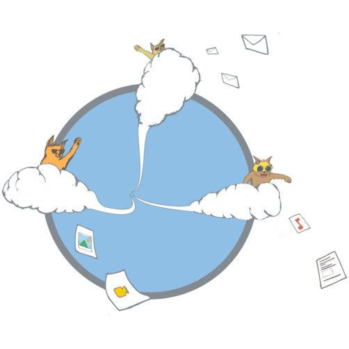

# Desarrollemos la informática campesina, criemos «gatitos»  [^1]

***Framasoft + AMIPO***

## Introducción

En los últimos años, hemos observado una centralización de prácticas en
la red entre un número muy limitado de proveedores de servicios en línea
representados por los ya conocidos GAFAM (Google, Apple, Facebook,
Amazon, Microsoft). Esta concentración, completamente contradictoria con
los orígenes de Internet pensada de manera descentralizada y
distribuida [^2], empujó a Tim Berners Lee, el creador de la web, a
formular propuestas para el futuro [^3]. Entonces, ¿por qué es necesario
preocuparse por esto? Simplemente porque los datos, y particularmente
nuestros datos personales, constituyen el carburante económico de estos
grandes actores y que semejante acumulación de información sobre
nosotros les confiere un poder inmenso, transformándonos en «productos»
gracias a sus servicios «gratuitos». Las cuestiones en torno a esto son
al final múltiples y complejas: vigilancia generalizada, inteligencias
artificiales alimentadas por el «*big data*», el fin del anonimato y de
la vida privada, freno a la libertad de expresión y de acceso a la
información, censura o pérdida de datos debidos al cierre de
servicios...Afortunadamente, una banda de irreductibles galos reunidos
alrededor de la asociación Framasoft [^4] están intentando de
«*desgooglizar*» Internet [^5] y extender esta iniciativa para que
podamos de nuevo «tomar el control» [^6].

## Los peligros

### Espionaje

Con el pretexto de proveer una «maravillosa experiencia para el
usuario», nuestros comportamientos en Internet son espiados
permanentemente. Estas informaciones pueden servir para mostrar
publicidad personalizada, pero las revelaciones del caso Snowden también
han evidenciado que los gigantes de Internet estaban obligados a
comunicar esos datos (a veces extremadamente privados: correos
electrónicos enviados por Gmail, fotos compartidas a través de Facebook,
conversaciones por Skipe, geolocalización de teléfonos, etc.) a los
servicios gubernamentales. Bajo el pretexto de la lucha contra el
terrorismo, los Estados actualmente son capaces de obtener más
información que la que jamás hubiera imaginado un «*Big Brother*».

### Vida privada

Nuestros datos son una extensión de nosotras mismas. Pueden indicar
dónde estamos, con quién, nuestra orientación política o sexual, los
sitios que hemos visitado, nuestra receta preferida, los temas que nos
interesan. Mientras que un dato solo, tomado de manera aislada, no es
necesariamente sensible, un conjunto de datos podría serlo (por ejemplo,
si has hecho búsquedas sobre el cáncer antes de suscribir un seguro de
vida).

En un mundo donde todo se vuelve digital (lectura, TV, teléfono, música,
red social, objeto conectados, etc.), nuestra vida privada es un
elemento esencial de lo que nos hace una persona única. Una persona
malintencionada que tuviera acceso a nuestro *smartphone* puede saber
suficientemente de nosotros, en pocos minutos, para causarnos un
perjuicio significativo (robo de identidad, desvío de información
profesional, difusión sin consentimiento, etc.).

### Centralización

Los grandes actores de internet se han convertido en verdaderos pulpos:
Facebook posee WhatsApp e Instagram, Google es titular de Youtube y
Waze, Microsoft distribuye Skype, etc. Dicha concentración plantea una
multitud de problemas: ¿qué ocurriría si Facebook cierra su empresa?
¿Cómo hacer búsquedas si Google sufre una avería? Poco a poco, nos
volvemos dependientes de servicios suministrados por un pequeño número
de actores. Por ejemplo, Apple (iPhone), Google (Android) y Microsoft
(Windows Phone) comparten la casi totalidad del mercado de sistemas de
explotación para *smartphones*.

Por otro lado, el tamaño de estos actores restringe la innovación: es
difícil emprender o lanzar un nuevo servicio frente a Apple o Google
(quienes copan actualmente la primera y segunda plaza entre las
capitalizaciones bursátiles mundiales). Por último, la falta de
diversidad de estos gigantes les otorga la posibilidad no sólo de
recolectar fácilmente informaciones personales, sino también de alterar
la información que difunden (una búsqueda Google con la palabra
«nuclear» no mostrará los mismos enlaces si te reconoce como una
militante ecologista o como una pro-nuclear).

### Cierre

Los servicios web de nuestro ordenador o *smartphone* se ejecutan
generalmente en la «*nube*» (conocido como cloud computing): servidores
dispersos alrededor del planeta, almacenando vuestros datos (correos
electrónicos, fotos, archivos, etc.) y el código de las aplicaciones.
Para los datos, esto presenta el problema de su perennidad (¿En qué se
convertirían nuestros archivos si Dropbox cierra mañana?), pero también
de su portabilidad e inter-operabilidad entre plataformas o servicios
diferentes (¿cómo recuperar todas vuestras fotos de Facebook o Picasa, y
reintegrarlas con sus comentarios en otro servicio?).

Para las aplicaciones, esto implica que estáis a la merced de los
cambios imprevistos decididos por sus proveedores (introduciendo
publicidad, modificando las interfaces, volviéndose de pago etc.). Pero,
sobre todo, que no tenéis casi ningún control sobre lo que la aplicación
puede hacer. Son «cajas negras» que pueden ser accionadas de manera
malintencionada (enviar mensajes sin consentimiento, ejecutar código
indeseable, etc.). En resumen, estas empresas nos encierran en jaulas de
oro, sin duda, pero ¡en jaulas de todos modos!

## Desgooglizar Internet

Mediante la iniciativa «Desgooglicemos Internet», Framasoft desea hacer
frente a estos peligros que amenazan nuestras vidas digitales
proponiendo servicios libres, éticos, descentralizados y solidarios.
Elaboran una lista de los servicios y software propietarios más
utilizados, desarrollando alternativas con software libre que puedan
cubrir estos usos [^7].

En 2017, cerca de cuarenta servicios en línea se han ofrecido
gratuitamente a los internautas para: almacenamiento de archivos en la
nube, agenda, contactos, edición colaborativa de documentos,
videoconferencia, cuestionarios, cartografía, mapa mental, reunión y
sondeo, listas de difusión, red social, libros en línea, motor de
búsqueda, juego educativo, gestión de proyectos… La lista es larga pero
«la vía es libre».

### Libertad

La historia de Internet es la de los programas de software libres, desde
el punto de vista de los estándares como de los protocolos empleados.
Debido a su popularidad y potencial le surgen envidiosos, y las grandes
empresas desearían tomar el control imponiendo su código cerrado en
sistemas cerrados y no interoperativos.

Para que Internet siga fiel a los principios fundadores que le han
llevado al éxito, las aplicaciones libres, es decir, con un código
fuente abierto, accesible y bajo licencias libres deben estar presentes.

### Ética

Framasoft se compromete a utilizar sólo software con un código fuente
«libre» apostando por un Internet que permita el intercambio y la
independencia. Framasoft rechaza la explotación, vigilancia, censura y
apropiación de datos en favor de la transparencia (honestidad), la
exposición clara de las condiciones de utilización de los servicios, y
el rechazo a las discriminaciones. Framasoft se compromete, así, a no
explotar los datos de los usuarios de sus servicios, y a promover una
web abierta e igualitaria.

### Solidaridad

Los servicios propuestos por Framasoft promueven un modelo económico
fundado sobre la mutualización de los costos, el intercambio de
recursos, y la accesibilidad al mayor número posible.

Este modelo posee también un carácter educativo porque al documentar el
desarrollo de los servicios, un gran número de usuarios podrán también
compartir estos recursos.

Creemos que no hay que infantilizar a las usuarias y compartir, con
todas ellas, la responsabilidad del uso de los servicios, así como la
regulación de los posibles abusos.

Framasoft se compromete a promover el respeto y la autonomía de sus
usuarias (mientras que se den relaciones de reciprocidad verdaderas).

### Descentralización

La inteligencia de Internet descansa sobre cada actor de la red gracias
a una dinámica de compartir entre pares evitando crear un nuevo Minitel
2.0 [^8].

Para asegurar la igualdad de todos, ciudadanos o empresarios, se deben
no solo evitar los monopolios, sino también impedir que se acaparen los
datos públicos y personales.

Framasoft facilita la difusión del código y diversifica los usos,
explicando a través de tutoriales cómo multiplicar las soluciones libres
permitiendo un internet más igualitario.

Asimismo, Framasoft se compromete a facilitar el auto-alojamiento y la
interoperatividad, con el objetivo de no «encerrar» a sus usuarios.

## El proyecto C.H.A.T.O.N.S.

Frente al éxito conseguido en su campaña Desgooglizar Internet,
Framasoft ha visto aumentar vertiginosamente el número de usuarias de
sus servicios en línea, lo que también conllevó un aumento en igual
medida de la carga de trabajo para mantenerlos y asegurar el soporte sin
dejar de proponer otros nuevos. La asociación, dirigida por cinco
miembros permanentes, se sostiene principalmente gracias a donaciones y
no desea crecer para poder mantener su tamaño «humano».

Para prolongar esta dinámica y fomentar la descentralización de los
servicios, Framasoft ha lanzado la iniciativa C.H.A.T.O.N.S. [^9]
(Colectivos de Alojamiento Alternativos, Transparentes, Abiertos,
Neutros y Solidarios) con el objetivo de que diferentes estructuras e
iniciativas que alojan servicios, datos y contenidos a su manera se
reúnan y adopten un manifiesto y una carta de valores comunes [^10].

Estos documentos son escritos y modificados colectivamente por los
miembros del colectivo, y tienen en cuenta la evolución de las
diferentes estructuras así como el entorno social, técnico y jurídico
del alojamiento de datos en Francia.

### Política general

El colectivo CHATONS posee un modelo de gobernanza que se inspira
directamente en el Software Libre. Las decisiones relacionadas con la
evolución del colectivo y de su Carta se toman de manera colegiada. Como
si se tratase de un código fuente, el modelo de colectivo puede ser
duplicado y modificado para adaptarse, por ejemplo a las
particularidades regionales.

Cada miembro es invitado a participar, tanto como sea posible, en la
toma de decisiones colectivas de manera consensuada. En caso de
conflicto de opinión, las decisiones se podrán tomar por mayoría simple.

El dominio chatons.org es mantenido y alojado por Framasoft (mientras
sea posible y hasta que el colectivo decida otra cosa). Se compone de un
sitio web, y también de una lista de difusión que permite la conexión y
el intercambio entre sus miembros.

No existe ningún estatuto administrativo de CHATONS ya que consiste
principalmente en una lista pública con miembros, así como un conjunto
de documentación para facilitar el intercambio de saberes, la
capitalización de buenas prácticas y la difusión.

Toda organización o colectivo que respete los principios del presente
manifiesto y la Carta de valores de CHATONS puede postularse como
miembro. Para mantenerse como miembro deberá comunicar algunas
informaciones como unos datos de contacto e inscribir al menos a uno de
sus propios participantes en la lista de discusión general.

Después de una discusión y eventualmente la formulación de sugerencias,
se lleva a cabo una votación por mayoría simple para la aceptación de
esta nueva organización en el colectivo. Uno o varios miembros pueden
reservarse el derecho a pedir la expulsión de otro miembro, siempre y
cuando, se den las siguientes condiciones:

 - sostener su propuesta con argumentos convincentes y conocidos por todos los
    miembros;
 - aceptar un voto colectivo, con o sin debate contradictorio.

Conscientes de que no es posible garantizar el respeto al conjunto de
los valores listados en la Carta de los CHATONS sin poner en peligro la
confidencialidad de los datos personales alojados en los sistemas
informáticos de los miembros, se presupone que el control entre pares
será *de facto* imperfecto. El colectivo apuesta antes que nada por la
confianza y la buena voluntad de los miembros en llevar a cabo los los
acuerdos.

Los CHATONS deberán por lo tanto encontrar, entre ellos, y respetando
los puntos de vista de cada uno, las buenas prácticas y las reglas de
inclusión, el cuestionamiento o exclusión de sus miembros, con el foco
puesto en dar prioridad al respeto de las libertades fundamentales y de
la vida privada de los usuarios utilizando los servicios del colectivo.

### Los compromisos

Los miembros del colectivo se comprometen a respetar la Carta de
valores, cuyos principios se enumeran a continuación.

 * Transparencia, no discriminación y datos personales

 * La honestidad es la palabra clave de estos compromisos, para asentar la
fiabilidad de los servicios propuestos y la confianza de los usuarios en
estos últimos. Las condiciones generales de utilización (CGU) deben ser
perfectamente claras, accesibles y no contradictorias con la Carta de
CHATONS.

 * El proveedor de alojamiento debe asumir y llevar una política abierta de
gestión de cuentas de usuarios: sin discriminación, que el acceso sea
gratuito o de pago, y con respeto a la jurisdicción del país en
cuestión.

 * El proveedor de alojamiento se compromete a dejar la posibilidad para
todos los usuarios de poder recuperar sus datos personales, cifrados o
no, salvo en el caso de servicios particulares basados en la
transferencia efímera y cifrada de las informaciones personales.

#### Apertura, economía, protección

Los servicios propuestos deben satisfacer algunas exigencias técnicas.
Los servidores deben principalmente basarse en soluciones de software
libres. Estos software permitirán la reproducibilidad del servicio sin
generar desarrollos adicionales en la estructura del servidor, o como
una contribución a estos software libres.

La utilización de los formatos abiertos es obligatoria, al menos para
todos los datos transmitidos a los usuarios. Esto supone una política
clara en favor de la interoperatividad. Así que, cuando el uso de
formatos abiertos es imposible (por ejemplo, si es necesario descargar
un programa para instalarlo en un sistema de explotación propietaria),
los datos deben ser bajo licencia libre y estar disponibles para un
máximo de sistemas operativos. Las fuentes deben ser accesibles.

Los miembros de CHATONS se comprometen a respetar los términos de las
licencias libres de los software que utilizan (incluyendo su mención y
hacer referencia de las fuentes etc.).

En términos éticos, se acepta el patrocinio, así como el mecenazgo, la
donación o el hecho de tener un modelo económico consistente para cubrir
los costes de las funcionalidades o incluso de todo el servicio. El
modelo económico de cada miembro de CHATONS debe ser claramente
explicado en una página dedicada, la cual debe ser entendible y
consultada fácilmente por el usuario. Evidentemente, los aspectos
económicos de la actividad de cada miembro de CHATONS deben conformarse
estrictamente a la legislación del país en cuestión.

Por el contrario, no se aceptará ninguna publicidad proveniente de
agencias publicitarias. No se realizará ninguna explotación de datos
personales, ni hará un seguimiento de las acciones de los usuarios salvo
fines estadísticos y legales, y las direcciones de usuarios sólo podrán
ser utilizadas con fines administrativos o técnicos. Las herramientas
estadísticas deberán, ellas también, ser libres y cumplir con las
condiciones del Colectivo.

#### Solidaridad y difusión

Los miembros de CHATONS se deben asistencia y ayuda mutua, a través de
una lista de discusión o por cualquier otro medio disponible, incluida
la celebración de reuniones periódicas. Es así que los miembros de
CHATONS podrán hacer progresar sus servicios. Uno de los medios más
eficaces para mantener esta sistemática ayuda mutua es la de contribuir
con el desarrollo de los software libres utilizados.

Los miembros no deben, sin embargo, permanecer inmersos en sí mismos lo
que sólo satisfaría a un número limitado de personas y generaría
discriminaciones en el acceso a los servicios. Al contrario, se anima a
emprender todos los esfuerzos de comunicación hacia el público para
difundir las soluciones de alojamientos libres y crear un vínculo
alrededor de los principios sostenidos por el colectivo. Los recursos
deben ser compartidos y pueden pasar por formaciones, sesiones
informativas públicas, colocación de paradas durante manifestaciones,
intervenciones en conferencias, publicación de folletos, etc.

#### Neutralidad

Los servicios de un miembro de CHATONS no podrán ser alojados por un
actor que, por reputación, no promueva la neutralidad de la red. Los
paquetes de datos deben transitar en los servicios del miembro de
CHATONS sin discriminación, lo que significa que no se debe examinar el
contenido, la fuente o el destino.

Ningún protocolo de comunicación podrá tener prioridad en el modo de
distribución de informaciones. Y ningún dato podrá ver su contenido
alterado arbitrariamente. La neutralidad de CHATONS es también una
neutralidad política en la medida en que las convicciones de cada
miembro no serán examinadas ni sancionadas, siempre y cuando, no excedan
el marco legislativo vigente.

### AMIPO, experiencia de un CHATONS en construcción en Orléans

La Asociación de Mantenimiento de la Informática Campesina de Orléans
(AMIPO, por sus siglas en francés de Association de Maintien de
l’Informatique Paysanne Orléanaises) es una de las variantes de las
«AMAP» francesas (Asociación de agricultores ecológicos que abastecen
con sus frutas y verduras a las personas abonadas). Se trata de la idea
de ir a buscar unos buenos *bytes* en la asociación local en vez de ir a
un gran «supermercado» americano. También es «campesino» aquel que
trabaja por su autosuficiencia contribuyendo a desarrollar su medio
ambiente y su paisaje...

La iniciativa C.H.A.T.O.N.S. empieza reuniendo un grupo de personas
motivadas por la intención de reflexionar de manera práctica sobre el
porqué del cómo. Desde los primeros prototipos de servicios instalados
en servidores reciclados conectados a un internet definitivamente
asimétrico (mayor capacidad de descarga que de subida con el ADSL [^11]),
se intenta pasar a un modo «producción» en servidores alojados por
proveedores éticos, en consonancia con nuestros valores (Como ARN [^12]
en Alsace o Tetaneutral [^13] en Toulouse).

Esto implica montar una estructura jurídica (en este caso una asociación
colegiada [^14], sin presidente, ni oficina), abrir una cuenta bancaria,
organizar una jornada de lanzamiento para recolectar fondos, crear
contenidos de sensibilización y realizar talleres dentro de la lógica de
educación popular, llegar a acuerdos sobre las tecnologías empleadas y
los servicios propuestos, definir si la página de inicio del sitio debe
ser http o https, crear las herramientas de comunicación y de
documentación, organizarse para instalar y administrar colectivamente
los servidores, asegurarse que se está conforme con la Carta agregando
particularmente las salvedades, proponer tiempos y canales de
comunicación para responder a las cuestiones de los usuarios...

Así la AMIPO tiene como objetivo ofrecer, en primer lugar , un servicio
de «*nube* personal» (basado en NextCloud [^15]) que permite hacer
inventarios de sus archivos, contactos y agendas, y esto gratuitamente,
con la posibilidad de disponer de un espacio más importante adhiriéndose
a la asociación. Las ganas del colectivo no terminan ahí, se podría
proponer a continuación un servicio de VPN (Red Privada Virtual [^16]),
trabajar en el cifrado de extremo a extremo de modo que no podamos ver
los datos que se nos confían, luego proponer servicios a las
asociaciones locales o acompañar los proyectos cooperativos en sus
prácticas informáticas.

Con nuestros dedos callosos de rudos campesinos informáticos, deseamos
así sembrar el máximo posible de semillas en las cabezas de nuestros
condiscípulos para que los pequeños *chatons* (gatitos) de píxeles
correteen en caminos libres y arbolados.

[^1]: NdT: En el original en francés juego de palabras, chatons se traduce como “*gatitos*” y también es el nombre del colectivo de alojamientos alternativos, trasparentes, abiertos, neutros y solidarios C.H.A.T.O.N.S. (por sus siglas, *Collectif des Hébergeurs Alternatifs, Transparents, Ouverts, Neutres et Solidaires*).

[^2]: El primer documento de Tim Berners-Lee para convencer a CERN que un sistema de hipertexto global era bastante interesante para el centro de investigación, este es el documento que prefigura la World Wide Web que hoy conocemos: https://www.w3.org/History/1989/proposal-msw.html

[^3]: https://www.theguardian.com/technology/2017/mar/11/tim-berners-lee-web-inventor-save-internet

[^4]: https://framasoft.org/

[^5]: https://degooglisons-internet.org/

[^6]: https://framabook.org/numerique-reprendre-le-controle/

[^7]: https://degooglisons-internet.org/alternatives

[^8]: Benjamin Bayart: Internet libre, ou Minitel 2.0?: https://www.youtube.com/watch?v=AoRGoQ76PK8

[^9]: https://chatons.org/

[^10]: https://chatons.org/charte-et-manifeste

[^11]: https://fr.wikipedia.org/wiki/ADSL

[^12]: http://arn-fai.net/

[^13]: https://tetaneutral.net/

[^14]: http://www.passerelleco.info/article.php?id_article=103

[^15]: https://nextcloud.com/

[^16]: https://fr.wikipedia.org/wiki/R%C3%A9seau_priv%C3%A9_virtuel
