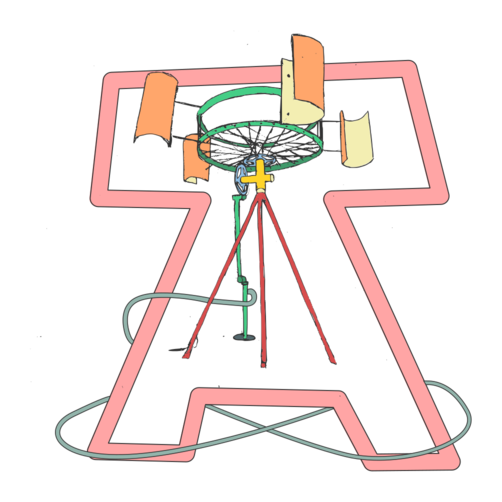

# Des technologies appropriées aux technologies réappropriées [^1]

***Elleflâne***

L'investissement en ressources dans le développement des
connaissances orientées directement vers la production ou le
développement de nouveaux processus et produits, transforme la
technologie que nous consommons en un bien commercial. Son acquisition,
sa transmission et son transfert ne sont plus un processus informel du
bien commun, ils deviennent formels, soumis aux lois et intérêts du
marché, des brevets et des registres de propriété intellectuelle. De ce
fait, la technologie se développe principalement dans les grandes
entreprises, corporations, États et gouvernements, et ses fruits
provoquent une mécanisation excessive, des déplacements humains non
nécessaires, une surexploitation des ressources naturelles et renforcent
l'absolue dépossession et la pénurie de connaissances de la part de ceux
qui utilisent effectivement ces technologies...

Des éléments comme l’absence de capacités scientifiques et
technologiques, le manque de conditions économiques propices au
développement d'innovations et l'usage d'un processus inadéquat
d'introduction des technologies dans l'appareil productif, génèrent des
changements économiques dans les réalités et les priorités des pays et
provoquent aussi des situations aberrantes dans l'utilisation des
ressources naturelles. Le déséquilibre dans le commerce des
connaissances creuse les inégalités entre les individus mais aussi entre
les pays qui sont des importateurs net de technologies et ceux qui sont
des simples consommateurs. La situation de dépendance et d'inégalité
s'observe quand la source principale de production des technologies se
situe à l'extérieur, et quand à l'intérieur on est incapables de générer
ou d'adapter des technologies propres. L'importation de technologies
n'est pas forcement désavantageuse, tous les pays la pratiquent. Ce qui
est mauvais est l'absence de politiques correctes pour le transfert des
connaissances associées afin de réduire les dépendances qui se créent de
cette façon.

L'adoption par un individu ou une communauté d'une technologie
inadéquate, c'est-à-dire une technologie qui n'est pas comprise, génère
une dépendance technologique vicieuse et une évolution économique
incompatible avec les nécessités sociales. L'évolution et le changement
technique dans les économies des pays du mal nommé « Sud global » est
substantiellement différent de celui observé dans les pays du Nord ou
bloc occidental.

Le capitalisme introduit des inégalités et des déséquilibres
technologiques mais ces derniers peuvent aussi stimuler la créativité et
le développement des technologies appropriées. Celles-ci peuvent générer
des processus d'autonomie imparables car en fin de compte, quelle
communauté n'a pas besoin qu'une technologie qui soit efficace, se
comprenne et s'adapte à son propre contexte environnemental, culturel et
économique?

## Des concepts entrelacés

Une technologie appropriée (*Appropriate Technology* [^1]), signifie
une technologie adaptée et aussi appropriée, copiée, obtenue. Les
technologies appropriées peuvent être *high* ou *low tech*, elles se
construisent et se distribuent sous licence libre, GNU GPL, logiciel
libre et de code ouvert. Elles peuvent appartenir à des champs d'action
variés en allant de l'agriculture, la permaculture, ou le jardinage, au
bâtiment, en passant par la communication, la santé et l'éducation.

Le terme est apparu dans le mouvement écologiste anglo-saxon pendant la
crise énergétique de 1973. Dans le livre *Small is beautifull* [^2],
l'économiste britannique E.F Schumacher promeut la valeur de la
technologie comme santé, beauté et résilience. Dans ce sens, une
technologie appropriée consiste en une technologie qui est en adéquation
avec une situation environnementale, culturelle et économique donnée,
qui a besoin de peu de ressources, implique des coûts peu élevés, n'a
pas besoin d'un haut niveau de maintenance, se génère avec des moyens,
des outils et des matériaux locaux et qui peut être réparée, modifiée et
transformée localement.

Le terme « appropriée », comme synonyme de ce qui est adapté peut être
source de confusion. Une technologie coûteuse peut être la plus adaptée
dans des communautés financièrement bien portantes, qui ont la capacité
de payer pour sa maintenance, et activent de ce fait un flux économique
qui renforcent ceux qui ont le plus de pouvoir économique.

Si on se réfère aux technologies intermédiaires, celles-ci peuvent aussi
être appropriées, et décrivent souvent une technologie beaucoup moins
coûteuse que la référence en la matière. Elle se construit en utilisant
des matériaux et des connaissances disponibles localement, elle est
facile d'accès et d'utilisation pour des personnes avec un accès réduit
aux ressources, et elles peuvent par ce biais renforcer leur capacité
productive tout en minimisant leur dislocation sociale.

Le *slow design* [^25] est une perspective holistique de design qui
prend en compte une plus grande gamme de facteurs matériels et sociaux,
et ses principaux impacts à court et à long terme. Dans *Slow Design, un
paradigme pour vivre de manière soutenable*, Alistair Fuad-Lucas
développe un design soutenable qui équilibre l'individu et ses
nécessités sociales, culturelles et environnementales. Le concept
s'applique à des expériences, des processus, des services et des
organisations. C'est un chemin vers la dématérialisation nécessaire pour
la soutenabilité à long terme, qui cherche le bien être humain et les
synergies positives entre les éléments d'un système, qui prône la
diversité et le régionalisme.

Les technologies réappropriées impliquent de revenir aux technologies
dont nous avons besoin. Il s'agit de placer la technologie au centre de
la vie, sur un axe transversal où se croisent d'autres disciplines comme
l'éthique, les problèmes sociaux, l'environnement, et chercher à toutes
les intégrer dans un ensemble. L'objectif est de préserver et défendre
la vie face au pouvoir, pour que cette vie ne soit pas opprimée. Lorsque
nous plaçons la technologie au centre, nous ne construisons pas
forcement un monde technologique comme celui que nous connaissons, plein
de dépendances et de frustrations, d'aliénations qui déséquilibrent la
balance entre le pouvoir et les opprimés.

Si notre but est d'opérer un changement social vers une société plus
soutenable, collective, communautaire et non purement mercantile, nous
devons changer les moyens, les ressources et les relations qui
soutendent actuellement une société basée sur des intérêts économiques.
Nous devons reprendre à notre compte, en tant qu'individus et
communautés, femmes et peuples, la partie expropriée de notre pouvoir
sur les technologies. Pour cela, il sera nécessaire de changer les
structures et surtout celles qui servent de base aux connaissances, car
si tout le système change, mais que les structures ni les relations
entre nous, alors rien ne changera.

Une Technologie Réappropriée permet de fissurer le système capitaliste,
en privilégiant la création de noyaux et de petites communautés
décentralisées qui favorisent les environnements d'autogestion et
d'équité, et aident à développer une société et une vie moins aliénante,
intégrée aux processus naturels.

Les Technologies Réappropriées s'implantent grâce aux individus et aux
communautés, et non pas aux gouvernements. Nous avons besoin d'une
Technologie Réappropriée pour faire face à l'industrialisation, qui se
base sur nos technologies propres, nos techniques et notre quotidien,
nos traditions ancestrales qui possèdent une base environnementale de
façon inhérente, soutenable et holistique. Des technologies pour créer
du bien être, de la beauté et de la communauté.

## Les technologies réappropriéesà partir mon expérience personnelle

Ces dix dernières années, j'ai essayé de concilier la théorie et la
pratique. Je me suis adaptée et j'ai changé ma pratique, j'ai crée des
protocoles et des licences libres qui défendent nos Technologies
Réappropriées, j'ai essayé de mettre en place des ateliers collectifs où
l'on partage des expériences et des savoir, où il est possible de créer
une activité productive qui couvre les nécessités basiques et apporte de
la richesse aux communautés.

J'ai découvert une « niche » économique pour les technologies
réappropriées, un exemple serait celui du producteur écologique de noix
et d'amandes qui veux être productif et soutenable, mais qui n'a pas de
solution intermédiaire entre le casse-noix et la super-machine à
plusieurs milliers d'euros. Les technologies réappropriées occuperaient
cet espace, s'adaptant à l'usager et à son environnement.

Dans la société et dans la majorité des mouvements sociaux, personne n'a
pas défendu la technologie, la science et la souveraineté technologique
en tant que pratique sociale, ni à un niveau individuel ni à un niveau
collectif. Le débat devient minoritaire et peu à peu, apparaissent dans
notre quotidien de nouvelles technologies qui nous rendent plus
dépendants et qui ont peu à voir avec les quatre libertés. Heureusement,
il y a toujours un groupe d'irréductibles qui inverse la perspective et
questionne la situation.

Dans la majorité des espaces technologiques, le gros des participants
appartient encore au genre masculin patriarcal. Cette tendance n'a pas
encore été inversée et souvent, le sexisme devient plus féroce, car il
n'intervient pas seulement dans les contenus, mais aussi dans les
formes, les relations, l'ambiance de compétition et d’ego qui se créent
au travail et qui ne peuvent être remises en cause sous peine de
victimisation extrême. Ce sexisme résulte de situations où les personnes
ne veulent pas se questionner et encore moins remettre en question leurs
privilèges car souvent, il est plus facile de se défendre que de faire
un travail intérieur. Je vais prendre un exemple réel qui m'est arrivé
avec deux conducteurs de grue de dépannage.

**Situation A:** Nous venions de terminer un travail qui était une
remorque à oxygène [^35] et quelqu'un devait venir l'emporter avec une
grue. Un type se présente. Il place des sangles et en les serrant fort,
il laisse une légère marque sur la carrosserie de la remorque qui est en
polycarbonate cellulaire. Je lui dis:

— Pardon, ce serait mieux de mettre un chiffon avant la sangle pour ne
pas faire de marque, comme ça, elle arrive en parfait état à mon client.

— Ne t'en fais pas, c'est bien comme ça, me dit-il sans m'écouter.

Je prends trente secondes avant de lui répondre.

— Hé, mettre un chiffon cela ne coûte rien.

— Mais oui, tu verras comme ceux du ferry ils vont te l'abîmer, ça c'est
rien, continue-t-il sans m'écouter.

Une minute de respiration, bon, je réfléchis, je suis la cliente, si je
lui dis de mettre un chiffon, il doit le faire. Pourquoi être aussi
buté?

— Excusez-moi mais c'est mieux si on met un chiffon.

Et finalement il le fait en râlant.

**Situation B:** Ma voiture est tombée en panne en plein milieu de la
montagne par un froid terrible et j'attends l'arrivée du dépanneur.
Arrive une femme dépanneuse et elle me dit que la voiture pourrait être
réparée à condition d'extraire un manchon. Elle n'y arrive pas car ses
mains sont gelées, ma main avance alors inconsciemment pour l'aider. Ok,
parfait, elle n'a pas eu peur, elle n'a pas dit que je la gênais, elle
me dit simplement merci et nous essayons de sortir la pièce ensemble.

L'attitude immobiliste de la situation A n'arrive pas chez tous les
hommes, ni la situation B chez toutes les femmes. Les attitudes
compétitives déracinées, immobilistes, oppressives, inégalitaires
appartiennent au patriarcat et nous en sommes tous les victimes, peu
importe notre genre. La technologie et la science comme outils au
service du pouvoir, avancent selon les directives du patriarcat et de la
société capitaliste.

De ce fait, les technologies réappropriées devraient être plus que les
objets technologiques et les sciences sont elles aussi l'ensemble des
relations qui se créent autour de ces objets. Est-ce que je pourrai
fabriquer des technologies réappropriés dans un atelier avec une
ambiance et des méthodes totalement patriarcales? Je crois que non,
cela n'aurait aucun sens.

Pour cela, il est nécessaire de placer la technologie au centre de la
vie, parler de pistons et de bielles, comme on parle de recettes de
cuisine. C'est ce que fait la *Jineology *[^33], elle ne sépare pas
l'objet du sujet, elle les mélange dans une relation saine, non comme
quelque chose d'extrême, sinon comme quelque chose que l'on peut
toujours améliorer et transformer.

Une autre nuance des technologies réappropriées consiste à savoir
comment on les applique. Si on utilise des analogies de la vie
quotidienne par exemple, nous pouvons simplement faire notre lit, ou
alors, secouer les draps et les couvertures à la fenêtre, les laisser au
soleil, brosser le matelas pour éliminer la saleté. Un autre exemple
serait celui de la crème hydratante, une chose est de l'appliquer avec
la main ou de se l'appliquer par petites touches pour rendre ses effets
plus puissants. Derrière toutes ces étapes il y a des techniques pour
l'amélioration de la vie.

La même logique s'applique à tout car tout a sa technique et sa science
en toile de fond. Apprendre ces petites choses n'est pas très difficile
même s'il est important de comprendre les raisons derrières ces
processus.

## Citons quelques technologies réappropriées

Dans le domaine du bâtiment, il existe une grande variété de techniques:
l'argile, le super argile, le Klinker, le torchis, entre autres.  Toutes
s'élaborent avec des matériaux locaux, relativement peu chers.  Architecture
pour l'Humanité [^10] suit des principes forts de technologie appropriée,
orientée vers des personnes touchées par des catastrophes naturelles.

Dans le monde de l'énergie, le terme « énergie douce » [^12] (*soft
energy*) de Amory Lovins décrit une énergie renouvelable et appropriée.
Cela s'applique en général à des communautés qui vivent en des lieux
isolées avec de faibles besoins en énergie. Il existe des solutions non
connectées au réseau électrique de type *off-grid* [^11]. Pour
celles-ci, les coûts d'investissement initiaux assez élevés et la
formation à sa maintenance doivent être pris en compte. Elles utilisent
des panneaux solaires (chers en principe mais simples), des générateurs
et des micro-turbines dans les chutes d'eau, l'énergie produite
s'accumule alors dans des batteries. Biobutane, biodiésel et huile
végétale peuvent être appropriés dans des zones où l'huile végétale est
accessible et plus économique que les combustibles fossiles. Le biogaz
est une autre source potentielle d'énergie, principalement làoù il
existe des quantités importantes de déchets de matière organique.

En illumination, la Light Up World Foundation [^13] utilise des LED et
des sources d'énergie renouvelable, comme les panneaux solaires, pour
faire parvenir l'électricité à des personnes qui ont peu de ressources
et qui vivent dans des zones reculées, remplaçant ainsi les dangereuses
lampes à kérosène. La Lampe de Bouteille Sûre (Lampara de Botella
Segura, son nom en espagnol) [^14] est une lampe à kérosène conçut au
Sri Lanka, qui possède un couvercle métallique et deux côtés plats pour
éviter qu'elle ne roule si elle est renversée.

Dans la préparation de nourriture et afin de réduire le travail à
fournir par rapport aux méthodes traditionnelles, on utilise des
technologies intermédiaires comme par exemple l'éplucheuse de
cacahuètes, en Malaisie. Les cuisines justes, les réducteurs de fumées
et les poêles efficients, produisent un gain de temps, réduisent la
déforestation et génèrent des bénéfices pour la santé. Briquette [^15],
développé par la fondation Legacy [^16], peut transformer les poubelles
organiques en combustible. Les cuisines solaires sont aussi adaptées
pour certaines zones, en fonction du climat et du style culinaire.

Pour le refroidissement, le Réfrigérateur Pot-in-Pot [^17] est une
invention africaine qui permet de maintenir les produits au froid sans
électricité. Cela peux supposer un grand bénéfice pour les familles qui
les utilisent, notamment pour les jeunes filles qui vendent des fruits
de mer frais sur le marché et qui peuvent ainsi les laisser dans
l'appareil pendant qu'elles vont à l'école.

Pour l'eau, le Hippo Water Roller [^18], permet de conserver davantage
d'eau à moindre effort. Le récupérateur d'eau de pluie requiert une
méthode appropriée de stockage, tout particulièrement dans des zones
sèches, et le Collecteur de Brume est quant à lui excellent dans des
zones où la pluie manque. Pour le traitement de l'eau, il faut des
standards élevés lorsque celle-ci doit être purifiée avant son
utilisation. . L'eau des forêts peut être suffisamment propre, en
fonction de la profondeur et de la distance des sources de pollution.
L'eau de pluie peut être propre si la zone de chute est libre de
contamination. Les principaux procédés de traitement sont : la
filtration, le biofilm, la sédimentation, la chaleur, la lumière
ultraviolette, et la désinfection chimique à l'eau de javel.

Les filtres doux de sable garantissent une bonne qualité de l'eau et
sont utilisés aussi bien dans des zones riches que dans des communautés
pauvres. Les graines écrasées de *Moringa oleifera* ou *Strychnos
potatorum* peuvent être utilisées comme fluctuants, les impuretés sont
facilement éliminées par sédimentation et filtrage. Le filtre de
céramique mélangé à de la matière organique comme le café se trouve dans
de nombreux foyers d'Amérique du Sud. Le LifeStraw [^19] est un petit
dispositif qui permet à l'usager de boire directement de l'eau sale. Les
filtres en toile ou la désinfection solaire sont adaptés à un usage à
petite échelle car ils nécessitent peu de contenants ou bouteilles.

Sur les questions d’accessibilité, la chaise roulante Whirlwind [^23]
permet la mobilité désirée pour des personnes qui ne peuvent pas
s'acheter les chaises utilisées dans les pays développés. Dans le
domaine de la Santé, BiPu [^20] est un système portable de toilettes
adaptées aux catastrophes naturelles. La projet Orange Pilot [^21] a
été une solution pour la crise alimentaire de quartiers urbains, et le
coût peu élevé des toilettes développées dans les villes du Bangladesh a
aidé à lutter contre les problèmes de santés dus aux toilettes à ciel
ouvert. De mêmes, les lits Reed [^22] ont servi à purifier les eaux
résiduelles. La santé écologique, traite les déchets humains, avec
l'objectif de protéger la santé humaine et l'environnement, à travers
l'utilisation de l'eau pour se laver les mains (et les parties intimes),
et le recyclage des nutriments pour réduire les besoins d'engrais
chimiques. , Pour la prise en charge de la santé, l'incubateur de
changement de phase, créé à la fin des années 1990, est une solution à
bas coût pour générer des échantillons microbiologiques. Ainsi, il
existe de nombreuses technologies appropriées pour l'amélioration de la
santé publique; surtout en ce qui concerne l'utilisation d'eau propre
dans le domaine de la santé.

Enfin, pour ce qui est des technologies de l'information et de la
communication, nous avons le 2B1 [^5] et le Simputer [^6] qui sont des
ordinateurs orientés vers les pays en développement, leur principal
avantage étant leur bas coûts, la résistance à la poussière, la
fiabilité et l'utilisation de la langue locale. ILDIS OnDisc [^7]
utilise des CD et des DVD dans des zones sans accès à Internet. Wind-up
[^8], de la Jhai Foundation, rend la radio, l'ordinateur et le système
de communication autonomes. Les téléphones portables peuvent aussi être
des technologies réappropriées dans des lieux où l'infrastructure
commerciale ne peut ou ne veut pas garantir une ample couverture. Loband
[^9], un web développé par Aidworld, supprime tous les contenus lourds
nécessitant une grande bande passante et les transforme en simple
texte; cela augmente la vitesse du processeur et s'adapte à des
connexions peu rapides.

## Conclusions

Il n'y a pas de technologie adaptée de manière absolue. Selon la ONUDI
[^26] il s'agit de « *la technologie qui contribue le plus aux
objectifs économiques, sociaux, et à la préservation de l'environnement,
en tenant en compte les buts du développement, les ressources et les
conditions d'application dans chaque territoire* ».

La technologie adaptée fait un usage optimal des ressources disponibles
dans un territoire pour le plus grand bien-être social de sa population.
Des secteurs différents de l'économie, aux caractéristiques différentes,
produisent des technologies différentes. Il est souhaitable de permettre
un modèle de développement où les ressources extraites peuvent se
renouveler lentement et de manière équilibrée. Il faut générer des
produits selon les niveaux de revenus et pour les différents styles de
vie qui existent. Garantir le nécessaire et ne pas créer des nécessités
artificielles. La petite échelle est préférable à la grande.

La gestion adaptée s'associe à la création, au transfert, à
l'adaptation, l'assimilation et à la diffusion en interne de la
technologie nécessaire pour atteindre les objectifs économiques et
sociaux, sans mettre en danger l'équilibre écologique. Pour les
atteindre, il doit exister un consensus et une organisation qui
réussisse à s'intégrer dans un processus continu de gestion
technologique, guidé par une stratégie qui harmonise le fonctionnement
du système techno scientifique avec la transformation et le
développement du système productif. Une organisation qui soit sans arrêt
en questionnement et qui fasse un effort particulier de divulgation et
d'éducation. Pour cela, il faut partir des nécessités locales, dans une
structure décentralisée, faite de petits noyaux et de communautés en
lien avec des réseaux de confiance et de réciprocité stables. S'il
existe une structure de gestion plus grande au sein des pays, elle doit
recueillir les besoins de ces noyaux, du bas vers le haut. Les pays et
les individus les plus pauvres doivent savoir qu'ils ont la possibilité
d'avoir une voix propre et la responsabilité de faire respecter leur
pouvoir de décision quant à leur évolution économique et sociale dans un
monde interdépendant.

[^0]: Il existe en espagnol une version plus longue de cet article à l'adresse suivante: http://elleflane.colectivizaciones.org/wp-content/uploads/2017/02/Tecnologias_reapropiadas2017.pdf

[^1]: Technologie appropriée: https://fr.wikipedia.org/wiki/Technologie_intermédiaire

[^2]: E.F. Schumacher: *Small is beautiful*.

[^5]: 2B1: https://en.wikipedia.org/wiki/2B1_conference

[^6]: Simputer: https://en.wikipedia.org/wiki/Simputer

[^7]: ILDIS OnDis: https://books.google.es/books/about/The_Transfer_of_Technology_to_Developing.html

[^8]: Wind-up radio: https://en.wikipedia.org/wiki/Human_power

[^9]: Loband: http://www.loband.org/loband/

[^10]: Architecture pour l'humanité: http://architectureforhumanity.org/

[^11]: Design off-grid: https://www.off-grid.net/energy-design-service-questionnaire-spanish/

[^12]: Soft Energy: https://en.wikipedia.org/wiki/Soft_energy_technology

[^13]: Light Up World Foundation: http://lutw.org/

[^14]: Lampe avec une bouteille sûre: http://tecno.sostenibilidad.org

[^15]: Briquette https://en.wikipedia.org/wiki/Biomass_briquettes

[^16]: Fundacion Legacy: https://www.legacyfound.org/

[^17]: Réfrigérateur pot-in-pot: http://www.mienergiagratis.com/energias/mucho-mas/mas-proyectos/item/66-p000028.html

[^18]: Hippo Water Roller: https://www.hipporoller.org/

[^19]: LifeStraw: https://eartheasy.com/lifestraw

[^20]: BiPu: https://en.wikipedia.org/wiki/BiPu

[^21]: Orange Pilot.

[^22]: Camas Reed: https://www.wte-ltd.co.uk/reed_bed_sewage_treatment.html

[^23]: Whirlwind: https://www.whirlwindwheelchair.org/

[^24]: Cloth Filter: https://en.wikipedia.org/wiki/Cloth_filter

[^25]: Slow design: https://en.wikipedia.org/wiki/Slow_design

[^26]: ONUDI, Organisation des Nation Unies pour le développement Industriel: https://unido.org

[^27]: A Guide for the Perplexed: http://www.appropedia.org/A_Guide_for_the_Perplexed

[^28]: Alternative technology: https://www.ata.org.au/

[^29]: Eco-village http://www.ic.org/pnp/cdir/2000/08ecovillage.php

[^30]: Stewart, Frances. *Tecnología y subdesarrollo*. 1983.

[^31]: Flit, Isaías. *Tecnologías apropiadas o manejo apropiado de las tecnologías*.

[^32]: Fuad-Luke Alistair. *Slow Design: Un paradigma para vivir de manera sostenible?*.

[^33]:
https://comitesolidaridadrojava.wordpress.com/2015/02/19/por-que-jineology-reconstruir-las-ciencias-hacia-una-vida-comunitaria-y-libre/

[^34]: Heberto Tapias García: *Tecnología adecuada*.

