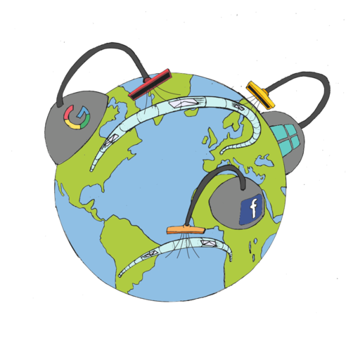

# Chiffrer les e-mails avec des outils accessibles
## L'adoption en masse des technologies de chiffrement

***Kali Kaneko***

Le chiffrement est l'application mathématique qui s'assure que nos
informations sont seulement accessibles pour les personnes ou les
machines avec lesquelles nous avons décidé de les partager. Le
chiffrement a une longue histoire. Les protocoles pour envoyer des
informations chiffrées sans se mettre d'accord au préalable avec une
autre partie sur un secret commun (pour déchiffrer des données
chiffrées) ont à peu près 35 ans. Le logiciel référence, Pretty Good
Privacy, souvent abrévié PGP, a mis en place un puissant chiffrement
d'e-mail avec des garanties de confidentialité, d'authentification et
d'intégrité largement disponibles pour les usagers et les développeurs
depuis 1991 [^0].

La relative popularité de PGP et sa standardisation ultérieure est
souvent dépeinte comme une victoire par les *cipherpunks* (les
activistes ayant recours à la cryptographie) de la première « guerre de
la cryptographie » [^1]. Alors, quels sont les obstacles à l'adoption
du chiffrement des e-mails par la critique et les masses ? Pourquoi
Greenwald, le très respecté journaliste, n'a -t-il pas pu chiffrer un
e-mail quand il fut contacté par sa source Snowden, l'analyste qui
travaillait pour la NSA [^2]?

Pour répondre à cette question, il nous faut d'abord regarder
l'architecture des services Internet, puis, l'économie de la
surveillance, et enfin, quelques échecs historiques d'utilisation.

## L'e-mail au temps de la surveillance capitaliste

L'e-mail est un protocole ouvert et fédéré qui a été recentralisé par
les gros fournisseurs d'accès à Internet. Ces compagnies exploitent
l'économie d'échelle qui conduit à la banalisation de l'e-mail. Les
externalités négatives de cette banalisation de l' e-mail incluent la
course aux armements pour empêcher l'industrie du spam d'envoyer aux
usagers de gros volumes d' e-mails non désirés et parfois frauduleux.

Aux débuts d'Internet, n'importe qui pouvait monter un serveur e-mail.
Durant la dernière décennie, par contre, on a assisté à une réduction
drastique du nombre de fournisseurs d'e-mail. Et ce n'est pas seulement
parce qu'un nombre limité de personnes et de collectifs ont leur propre
serveur d'e-mail, mais c'est aussi parce que de moins en moins de
personnes savent qu'il est possible de le faire. L' e-mail est devenu un
autre exemple de technologie supposée être « simplement là ».
L'explication de ce manque d'implication semble être qu'on ne peut pas
gérer des infrastructures vitales pour s'amuser. Il se passe quelque
chose de similaire avec la messagerie instantanée [^3].

Perdre la bataille des architectures libres et fédérées, veut aussi dire
perdre le contrôle des infrastructures de communication que nous
utilisons. L'augmentation des pratiques de monopole conduit à un manque
d'interopérabilité entre les fournisseurs et cela crée une barrière pour
l'entrée de nouveaux fournisseurs d'e-mail.

La monoculture est en effet indispensable au contrôle centralisé: cela
signifie qu'une personne a seulement besoin de la coopération d'une
autre personne pour compromettre les communications privées de millions
de gens. L'e-mail n'est pas seulement une question de messages: c'est
aussi l'une des dernières lignes technologiques de défense sur Internet
pour des alternatives localisées et respectueuses de la vie privée dans
la provision d'identité. Les fournisseurs de messagerie électronique ont
encore le choix de donner à leurs utilisateurs une interface anonyme ou
de pseudonyme, et peuvent encore refuser de tracer ou de vendre leurs
données.

Nous voyons de plus en plus comment les dispositifs mobiles, à la place
des comptes e-mail, sont nécessaires à la communication *bootstrapping*
avec nos contacts. Le téléphone est devenu la porte d'entrée des jardins
fortifiés de Facebook dans de nombreux pays [^4].

Les gouvernements et les entreprises se ruent sur le déploiement d'une
surveillance invasive. Quand les grands pouvoirs investissent autant
d'argent pour éroder les droits fondamentaux des individus et des
communautés à décider de leur communication, construire -et utiliser-
des outils pour la confidentialité est un impératif moral. Le droit au
chuchotage est un droit irrévocable et fondamental qui est en train de
nous être enlevé par la force. Sa criminalisation et sa disparition ont
un profond impact sur notre capacité à exercer nos droits humains et à
construire des sociétés démocratiques.

## Nous n'avons pas réussi à renforcer les capacités des citoyens par le chiffrement

Stratégiquement, l' e-mail parait un choix bizarre aujourd'hui, dans un
panorama mouvant au niveau technologique, qui conduit de plus en plus
vers des applications mobiles, et où la plupart des usagers ont fait
leur première expérience de l'Internet déjà à travers les grands silos
de données (*Big Silos,* en anglais). L' e-mail est parfois qualifié de
technologie obsolète parce que son architecture rend difficile le
chiffrement des messages, notamment si l'on veut cacher qui écrit quoi à
qui.

Cependant, même si une technologie plus intéressante et plus résistante
aux possibles attaques émerge dans le futur, l'e-mail restera utilisé
encore un certain temps. Il est le moyen de communication asynchrone que
nous avons et que nous devons protéger. Des millions d'e-mails sont
encore envoyés chaque jour sans être cryptés, et des e-mails avec des
expéditeurs non vérifiés sont encore utilisés pour des attaques
d'hameçonnage dévastatrices [^100].

Il est difficile de savoir si nous faisons face à un simple problème
d'utilisation, ou si au contraire, il s'agit d'un manque général
d’intérêt à propos de: 1. l'e-mail comme un outil ; 2. la vie privée et
la sécurité dans les communications en ligne ; ou 3. un mélange des
deux.

Le stockage à un niveau commercial est bon marché, et les fournisseurs
qui fonctionnent grâce à l'exploitation des silos de données et de
métadonnées peuvent se permettre de fournir du mail « gratuitement ». Il
est évident que ces fournisseurs n'ont pas un grand intérêt pour le
chiffrement car cela compromettrait leur modèle économique. Même ceux
qui soutiennent le chiffrement font des bénéfices à partir de l'analyse
du trafic.

Il a été démontré que les usagers sont prêts à payer un surcoût pour des
services ou des applications qui respectent leur vie privée [^7],
mais les fournisseurs d'e-mails qui les proposent doivent se battre avec
les acteurs majeurs du marché qui exploitent les économies d'échelle
pour offrir une base de 15GB de stockage « gratuite », une grande
fiabilité, de la vitesse, etc. En d'autres termes, il y a de nombreuses
personnes critiques qui pourraient contribuer à des fournisseurs
soucieux de la vie privée, mais la facilité d'utilisation et les coûts
relativement bas rendent très difficile le combat contre les monopoles
établis.

Dans ce sens, toute tentative sérieuse visant à fournir des alternatives
doit prendre en compte la soutenabilitié de projets technico-politiques
comme celui de fournisseurs d'e-mails respectueux de la vie privée.

## C'est aussi un problème d'« outils pour nerds »

L'approche classique « *scratch your itch* » (« Grattez** **là où ça
vous démange ») de la communauté du logiciel libre ne colle tout
simplement pas avec une optique d'adoption massive. L'autodiscipline et
la qualité sont des clés pour faire durer une communauté autour de
logiciels plaisants, faciles d'utilisation et efficaces.

Étant donné les énormes sommes que le capital a investi dans le contrôle
cybernétique des masses, les attentes des usagers en termes de facilité
d'utilisation sont très grandes. Interagir avec des outils numériques ne
devrait demander que de tous petits effort cognitifs. Les nouvelles
technologies qui défient trop de conventions (langage visuel et bonnes
pratiques comme les métaphores communes, les interfaces connues, les
possibilités de multiples appareils connectés, le design mobile, etc.)
dressent des barrières contre leur adoption. La requête permanente des
usagers aux développeurs pour les fonctions du bien connues du « mur »
ou du « like » dans les nouvelles technologies montre à quel point des
symboles arbitraires se sont normalisés.

Néanmoins, Néanmoins, la simplification
excessiveNéanmoins, Néanmoins, la simplification excessive au prix de la
dissimulation irrévocable de la complexité auprès de l'utilisateur n'est
pas la seule option disponible, celle-ci étant bien souvent
contre-productive. On peut rêver à une interface qui simplifie la vie de
tous les jours, mais qui permet aussi aux utilisateurs d'explorer
d'autres possibilités au fur et à mesure de leur apprentissage.

Le développement dirigé par « l'esprit nerd » change aussi de focus
chaque fois qu'une nouvelle technologie pimpante fait son apparition.
Cela peut en partie expliquer pourquoi certaines technologies stagnent
ou disparaissent. Il nous faut cultiver l'excellence, y compris dans les
technologies qui ne bénéficient pas de cette excitation associée aux
nouveaux développements. Si nous voulons que le chiffrement se diffuse
en dehors du *ghetto tech*, les outils inutiles qui ne sont qu'à moitié
finis et pas mis à jour doivent être abandonnés. Aussi, l'exigence quant
à ce que doivent connaître ou savoir faire les utilisateurs avant même
de pouvoir accomplir la moindre petite tâche doit être revue à la
baisse.

Un exemple de technologie inopérante est l'utilisation du système Web of
Trust*,* dédié à identifier les adresses mails authentiques. Les
tentatives didactiques pour expliquer la nécessité du chiffrement ont
échoué ces dernières années, peut être à cause du fait que cette
technologie s'est basée sur de fausses suppositions dès sa création
[^8].

## Vers de possibles solutions

Depuis l'ère post Snowden, de nombreux projets ont vu le jour.  Ci-dessous,
j'en mentionne un auquel je participe et d'autres que je considère
intéressants, à la fois en tant que logiciels de travail et protocoles
évolutifs. Ma perspective se centre sur des initiatives qui construisent des
solutions d'interopérabilité au-delà de l'infrastructure existante d'e-mails
et qui utilisent le standard OpenPGP [^15]. Je fais aussi brièvement référence
à quelques nouveaux silos qui essaient de rentabiliser le *crypto fuzz*.

### Bitmask et LEAP Encryption Access Project

LEAP est une organisation qui a pour but le développement de services de
messagerie chiffrée faciles à développer et à utiliser [^9]. LEAP met
en œuvre de façon opportuniste le chiffrement des e-mails, un processus
transparent qui requiert seulement un petit effort cognitif de la part
des utilisateurs, et des coûts de maintenance bas pour les fournisseurs.
Les logiciels LEAP peuvent amener de nombreux fournisseurs fédérés à
entrer dans le domaine de la messagerie, en baissant les coûts
techniques et économiques.

Du côté des serveurs, la plateforme LEAP propose un set de logiciels et
de protocoles complémentaires pour automatiser la maintenance des
services LEAP. Son but est de faciliter au maximum le travail des
administrateurs système en termes de développement et de maintenance
pour la sécurité des services de communication, ainsi que d'aider les
fournisseurs à gérer les inscriptions et la comptabilité.

Du côté des utilisateurs, l'application Bitmask fonctionne en toile de
fond. Elle fait office de proxy pour le même programme de messagerie que
l'utilisateur a l'habitude d'utiliser. De manière alternative, une autre
interface est disponible et fonctionne dans le navigateur (à travers une
version personnalisée de Pixelated [^16].  Bitmask trouve automatiquement la
clé de chiffrement pour une adresse e-mail, et fonctionne sur différentes
machines. Toutes les données (y compris la base de données des clés de
chiffrement et l'e-mail en lui-même) sont chiffrées de bout en bout, ce qui
veut dire que le fournisseur de messagerie n'a pas accès aux contenus. Dans le
cadre du projet Panoramix [^17], des fonctionnalités de routing anonyme pour
lutter contre le trafic de données seront aussi ajoutées, afin de garantir un
plus haut niveau de sécurité.

### Jette tes métadonnées dans le Memory Hole

Dans un e-mail, les données sont le contenu: la lettre que vous
écrivez. Les métadonnées sont l'ensemble des éléments qui aident le
contenu à arriver au destinataire ; c'est l'équivalent du timbre, de
l'enveloppe, de l'adresse du destinataire et de l'expéditeur dans une
lettre classique.

La technologie conventionnelle du chiffrement des e-mails ne s'occupe
que de la protection du contenu du message. Néanmoins, les métadonnées
restent visibles dans l'opération. Les intermédiaires qui font office de
facteurs peuvent voir votre adresse, l'expéditeur, la date, le sujet et
même le chemin parcouru par le message jusqu'à son destinataire.

Le projet Memory Hole (Trou de Mémoire, en français) [^18], a pour objectif de
régler ce problème en mettant les métadonnées dans le contenu de l'e-mail de
manière standardisée. En d'autres termes, il s'agit de cacher autant de
métadonnées possible dans l'enveloppe « protégée » des intermédiaires, comme
les fournisseurs de messagerie ou les agences d'espionnage.

En mettant en place ce standard proposé, tous les programmes d'e-mails
compatibles avec Memory Hole peuvent protéger un bon nombre de
métadonnées des intromissions et des modifications lors de leur
transfert.

Demandez cette fonctionnalité dans un future proche !

### Autocrypt: un seul chiffrement, plein d'e-mails

Le projet Autocrypt [^19] développe un chiffrement des e-mails qui peut être
valable dans le cadre de son adoption en masse, même s'il n'est pas aussi
sécurisé que le chiffrement des e-mails classique.

Le projet est piloté par un groupe très diversifié de développeurs
d'application de messagerie, de hackers et de chercheurs, qui sont prêts
à considérer une approche nouvelle, à apprendre des erreurs du passé, et
à faire augmenter l'adoption du chiffrement des e-mails dans son
ensemble. Des logiciels populaires comme K9 (une application e-mail pour
mobile), Enigmail (un plug-in de chiffrement pour le gestionnaire
d'e-mail Thunderbird) ou Mailpile (une interface en ligne pour l'e-mail)
soutiennent déjà ce protocole.

Autocrypt utilise des e-mails classiques pour échanger de l'information
et permet le chiffrement des messages ultérieurs. Il ajoute des
métadonnées à l'e-mail qui stocke les clés de chiffrement associées aux
utilisateurs, tout comme leurs préférences dans leurs habitudes de
chiffrement.

### La famille des webmails: des clients e-mail modernes construits sur des technologies web

Une interface webmail offre une expérience intuitive à l'utilisateur.
Elle fonctionne dans n'importe quel navigateur. Les applications dans le
navigateur posent certains problèmes de sécurité (un code d'exécution
invérifiable, du stockage de données secrètes présentant une large
surface ouverte aux attaques), mais elles permettent aussi une adoption
par tous plus facile.

Mailpile [^10] est un service e-mail auto-hébergé. Son interface
utilisateur a l'avantage d'être largement compatible avec les standards
du web comme HTML5 et Javasripts. L'interface se connecte à un serveur
dorsal qui est généralement installé sur une machine en local, mais qui
peut aussi fonctionner sur un serveur. Elle est compatible avec un
chiffrement de bout en bout via le standard traditionnel OpenPGP.
L'interface met l'accent sur la recherche et le taggage, ce qui la rend
similaire à l'interface web populaire de Gmail, et la différencie de
nombreux autre logiciels libres d' e-mails. L'initiative Mailpile
détient un grand potentiel, notamment depuis que la fondation Mozilla a
cessé de soutenir le développement de sa plus grande alternative, le
logiciel de messagerie électronique de bureau Thunderbird.

Une autre approche intéressante du système ouvert webmail est Whiteout,
qui a fermé en 2015 avec plus de 10 000 utilisateurs. Leur logiciel
libre améliorait les protocoles d'interopérabilité. Dans une note post
mortem, ils partageaient quelques estimations de ce à quoi ressemblerait
un marché viable des applications de chiffrement d'e-mails [^11], et
aussi, la leçon apprise quant à la non validité du modèle des start ups
pour faire face au problème de la surveillance.

Mailvelope [^12] peut être une option appropriée quand des compromis
doivent absolument être faits. Il s'agit d'une extension de navigateur
qui vous permet d’utiliser le chiffrement e-mail OpenPGP avec les
fournisseurs de messagerie majoritaires comme Gmail, Yahoo et Outlook.
Les fournisseurs de messagerie libres populaires comme Rouncube (les
messageries en ligne que proposent les projets comme Riseup ou
Autistici) sont aussi compatibles le plug-in Mailvelope [^13].

### Des services de messagerie non e-mails

Pour finir, je voudrais mentionner quelques initiatives qui gagnent du
terrain chez les utilisateurs qui veulent un fournisseur de messagerie
sécurisé, mais qui ne peuvent pas être considérées comme un service
d'e-mails interconnecté et chiffré. Elles sont généralement compatibles
avec un chiffrement de bout en bout seulement entre les utilisateurs
d'un même service, et repassent à des messages non-chiffrés pour des
utilisateurs d'autres services de messagerie. Certaines de ces
initiatives demandent aux utilisateurs de différents services de
partager un secret manuellement, ce qui met en échec le l'objectif même
d'une clé de chiffrement publique, pierre angulaire du standard OpenPGP
utilisé par les autres projets, contribuant ainsi encore davantage à la
centralisation de l'écosystème.

Les exemples connus de ce type de services de messageries non
centralisées sont ProtonMail (une application de messagerie qui
n'applique le chiffrement qu'entre ses utilisateurs, et envoie des
messages non cryptés aux autres) et Tutanota (une interface mobile de
messagerie web qui requiert un destinataire externe pour décrypter le
message sur le site de Tutanota grâce à un secret préalablement
partagé).

Pour une revue détaillée d'autres initiatives, et une vue d'ensemble des
projets qui permettent le chiffrement des e-mails, une comparaison
poussée est disponible en ligne [^14].

## Les défis à venir

La quête permanente pour réduire les interceptions de nos communications
globales est encore en cours. Le défi est de reprendre collectivement le
contrôle sur les messageries, et comme nous l'avons montré dans ce
texte, certains projets font de grands progrès en adoptant de nouvelles
stratégies pour faire adopter massivement l'utilisation du chiffrement
des e-mails.

L'espoir réside dans le fait que dans les prochains mois, de meilleurs
programmes pour le chiffrement puissent fonctionner ensemble, de manière
plus automatique, demandant moins d'interventions de la part des
utilisateurs, tout en assurant que ces derniers puissent décider qui a
le droit de voir leurs messages quand ils voyagent à travers Internet.

Cependant, les programmes ne s'écrivent pas tout seuls: je vous encourage à
essayer tout particulièrement les services comme K9, Enigmail, Mailpile et
Bitmask. Essayez-les. Essayez-en plusieurs.  Essayez-les avec vos amis, avec
vos familles. Engagez-vous dans leurs communautés, rejoignez leurs mailing
listes et leurs canaux IRC.  Apprenez-en plus sur leurs forces et leurs
faiblesses. Faites remonter les problèmes quand ils surviennent, essayez de
nouvelles versions, écrivez ou améliorez des traductions dans votre langue,
commencez à héberger un nouveau fournisseur de messagerie si vous pouvez, et
surtout, continuez à contribuer au processus de création collective. Si vous
croyez au droit de chuchotage, engagez-vous dans le débat global et faîtes
entendre votre voix.

En attendant de vous lire de manière sécurisé dans les intertubes,
faîtes attention à vous!

[^0]: Il y a différentes propriétés que les solutions de chiffrement ont traditionnellement voulu fournir. La *Confidentialité* est obtenu par le chiffrement des messages, ce qui veut dire les découper de manière à ce qu'une tierce partie ne puisse pas comprendre leur contenu et de faire que retrouver le message original soit presque impossible par une tierce personne. L'*authentification* se fait en signant le contenu du message à un bout et en vérifiant la signature à l'autre bout pour s'assurer que le message a bien été envoyé par son auteur. La manière dont fonctionne le chiffrement permet aussi de préserver l'intégrité du contenu, en s'assurant qu'il n'y ait pas de tierce partie (comme un gouvernement, une entreprise ou des personnes malveillantes) qui ait changé le message pendant son transfert.

[^1]: Pendant la guerre froide, les États-Unis et leurs alliés ont développé un corpus complexe de règles de contrôle à l'export pour empêcher un large éventail de technologies occidentales de tomber aux mains d'autres puissances, particulièrement du Bloc de l'Est. Les contrôles à l'exportation de la cryptographie deviennent un sujet d'intérêt pour le public avec l'introduction de l'ordinateur personnel.  Le PGP de Zimmermann se répand sur Internet en 1991 et devient le premier défi individuel aux contrôles à l'exportation de la cryptographie, et finalement, la popularisation du e-commerce à probablement joué un rôle majeur dans la lutte contre les restrictions.  https://en.wikipedia.org/wiki/Crypto_Wars

[^2]: Quand Snowden essaya pour la première fois de contacter le journaliste du Guardian Glenn Greenwald, les hackers cryptographe et les activistes de la vie privée ont expérimenté collectivement une dure réalité qui a fait explosé notre petite bulle: il n'y a pas de sécurité efficace sans facilité d'utilisation. Si un analyste de la NSA est obligé de monter d'atroces vidéos pour enseigner à un journaliste comment installer un outil appelé GPG4win, téléchargé depuis un site pourri, faire quelques effrayants copier/coller et autres délices [que l'on peut voir dans la vidéo de 12 minutes: http://www.dailymail.co.uk/embed/video/1094895.html], on peut penser à raison que la facilité d'usage, et l'état général du chiffrement de message est « profondément mal en point ». Donc, 10 ans après l'article fondateur, on peut affirmer avec tristesse que Johny ne peut toujours pas chiffrer: https://people.eecs.berkeley.edu/~tygar/papers/Why_Johnny_Cant_Encrypt/OReilly.pdf

[^3]: En d'autres mots: la mort lente de Jabber/XMPP. C'est frustrant, quand encore et encore, la fragmentation d'un écosystème libre amène à des solutions centralisées. On peut comprendre les diatribes des développeurs de Signal et du crypto anarchiste Moxie Marlinspike contre les fédérations seulement en terme de volonté de déployer des mises à jours pour des millions d'utilisateurs sans passer par la longue file d'attente du consensus décentralisé. Dans les applications mobiles de messagerie, Signal est actuellement la meilleure chose que l'on ait, mais cela représente une anomalie du processus technologique qui empêche la fédération libre des infrastructures de communication de devenir une réalité aujourd'hui.

[^4]: Et avec le téléphone, la politique du nécessaire enregistrement avec un vrai nom. Les compagnies de télécommunication forcent ces pratiques au nom de la législation des États qui ont passé des lois contre l'anonymisation.

[^5]: http://codev2.cc/download%2Bremix/Lessig-Codev2.pdf

[^6]: Des projets comme Pond, Retroshare ou Secushare peuvent être de bons aperçus de ce que pourrait être une messagerie sécurisée, et standardisée. https://github.com/agl/pond • http://retroshare.us/ • http://secushare.org/ • Notons que l'auteur de Pond recommande l'usage de l'application Signal pour pratiquer jusqu'à ce que son propre logiciel soit plus au point et révisé.

[^7]: Voir par exemple The Value of Online Privacy et What is Privacy Worth?: https://papers.ssrn.com/sol3/papers.cfm?abstract_id=2341311 • https://www.cmu.edu/dietrich/sds/docs/loewenstein/WhatPrivacyWorth.pdf

[^8]: https://github.com/micahflee/trollwot

[^9]: https://downloads.leap.se/publications/cans2016.pdf

[^10]: https://mailpile.is/

[^11]: https://tankredhase.com/2015/12/01/whiteout-post-mortem/index.html

[^12]: https://mailvelope.com/

[^13]: https://roundcube.net/news/2016/05/22/roundcube-webmail-1.2.0-released

[^14]: https://github.com/OpenTechFund/secure-email

[^15]: https://openpgp.org/

[^16]: https://pixelated-project.org/

[^17]: https://panoramix-project.eu/

[^18]: https://modernpgp.org/

[^19]: https://autocrypt.readthedocs.io/

[^100]: L’*hameçonnage*, *phishing* ou *filoutage* est une technique utilisée par des fraudeurs pour obtenir des renseignements personnels dans le but de perpétrer une usurpation d'identité: https://fr.wikipedia.org/wiki/Usurpation_d%27identité. La technique consiste à faire croire à la victime qu'elle s'adresse à un tiers de confiance — banque, administration, etc. — afin de lui soutirer des renseignements personnels: mot de passe: https://fr.wikipedia.org/wiki/Mot_de_passe, numéro de carte de crédit: https://fr.wikipedia.org/wiki/Carte_de_crédit, date de naissance, etc. Voir: https://fr.wikipedia.org/wiki/Hame%C3%A7onnage
