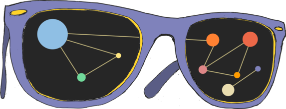

# Technologische soevereiniteit: Waar hebben we het over?

***Margarita Padilla***

## Wat is technologische soevereiniteit?

Beste lezers, ik zou het hier graag hebben over technologische soevereiniteit, een concept dat misschien nog weinig voor je betekent.

Wikipedia stelt dat "soevereiniteit" de hoogste politieke macht is. Soeverein zijn betekent in staat zijn om zelfstandig te beslissen, de macht te hebben om wetten te maken zonder dat die worden opgelegd door anderen. Het is onmogelijk om soevereiniteit te begrijpen zonder rekening te houden met de strijd om de macht: de geschiedenis definieert de kwestie van soevereiniteit, wat is en wat zal worden, en op elk moment, wie soeverein is.

Als we de kwestie van soevereiniteit overhevelen naar de technologieën, dan wordt de vraag die we willen bespreken: wie heeft de macht om hierover beslissingen te nemen? Over de ontwikkeling, over het gebruik, over toegang en over distributie, over aanbod en consumptie, over het prestige dat ze hebben en hun vermogen om ons te boeien ...

Ik denk dat er aangaande de vraag rond macht geen eenvoudige antwoorden zijn te geven. Toch zijn er wenselijke en gewenste horizonten. Met deze publicatie hopen we even te pauzeren en na te denken over de technologische horizon die we uitstippelen, kritisch te oordelen en vooral onze ideeën te delen.

In informele gesprekken over technologieën zeggen vrienden vaak dingen als "dat begrijp ik gewoon niet", "daar ben ik niet zo goed in"... Dus probeer ik de focus te verleggen naar een ander, meer politiek terrein. Ik ben er vast van overtuigd dat wat een enkeling wel of niet weet, niet echt zo'n belangrijk onderdeel is van een algemene benadering van technologieën.

Deze verschuiving wordt reeds op andere gebieden toegepast. Ik hoef bijvoorbeeld persoonlijk geen chemie te kennen om te "weten" dat de lucht vervuild is. Ik zeg "weten" tussen aanhalingstekens omdat ik het niet echt weet, in de wetenschappelijke zin van het woord, omdat ik nog nooit zelf een analyse van de luchtverontreiniging heb uitgevoerd. Ik "ken" het echter wel in sociale termen, omdat veel groepen en individuen die ik vertrouw mij dat hebben verteld. Voor mij is de overtuiging dat de lucht vervuild is, een sociale waarheid.

Iets soortgelijks komt voor bij biologische voeding. Ik hoef niet naar elke biologische producent te gaan om een chemische analyse uit te voeren van de voedingswaarde van hun producten. Er is een keten van vertrouwen, een circuit dat maakt dat wat ik persoonlijk wel of niet weet irrelevant is. Ik baseer mijn ideeën op wat deze gedeelde kennis als sociale waarheid presenteert.

Mijn horizon op het gebied van technologische soevereiniteit bestaat evenmin uit zelfvoorzienende individuen die elk detail van hun apparaten en de programma's op hun computer of mobiele telefoon beheren. Het is geen technologisch individualisme (zoals ik het begrijp, weet, ik blijf zeggen ...). Ik geloof niet dat het onderwerp van technologische soevereiniteit het individu is (je kent hem wel, die jonge, knappe, intelligente, succesvolle, blanke man ... vooral, omdat hij niet bestaat).

## Waar gebeurt het?

Net als alle andere soevereiniteit wordt technologische soevereiniteit in gemeenschappen gemaakt.

Gemeenschappen bestaan en ze zijn overal. Ze creëren en herscheppen zichzelf onophoudelijk. Gedeelde flats, buurten, vrienden, collega's, professionele netwerken, uitgebreide families, ... Gemeenschappen zijn overal.

Zoals bij elke symbolische constructie zijn gemeenschappen niet iets wat je met je ogen kunt zien. Ze zijn iets wat je ziet met je geest en de banden voel je met je hart.

Dit betekent dat in dezelfde situatie een gemeenschap heel reëel en actief kan zijn voor sommige mensen, maar totaal onzichtbaar voor anderen. Dit is een reëel probleem, want als je niet ziet waar gemeenschappen lopen, loop je het risico ze te vertrappelen. Hoewel de technologische industrie er vaak niet naar streeft om gemeenschappen te vertrappelen, maar om ze te controleren.

Voor degenen onder ons die vechten voor technologische soevereiniteit, zijn gemeenschappen een tastbare realiteit. Ze zijn er, we zien ze en we voelen ze. Hoewel technologie meestal in verband gebracht wordt met consumentisme, elites, luxegoederen en geïsoleerd individualisme, is dit slechts de visie van de industrie en de markt. Een markt die de consument wil isoleren en verbluffen.

Alle technologie is ontwikkeld in de gemeenschap. Deze gemeenschappen kunnen min of meer autonoom zijn, of min of meer gecontroleerd worden door bedrijven. De strijd om soevereiniteit gaat over deze gemeenschappen. Niemand bedenkt, bouwt of codeert alleen omdat het gewoonweg onmogelijk zou zijn.

Het uitgangspunt van een gemeenschap die soeverein wil zijn, is dat alle kennis moet worden gedeeld, en alle individuele ontwikkelingen moeten worden teruggegeven aan de commons. Kennis groeit door samenwerking. Intelligentie is collectief en het privatiseren van kennis is het doden van de gemeenschap. De gemeenschap staat borg voor de vrijheid, dat wil zeggen voor de soevereiniteit.

De relatie tussen gemeenschappen en kennis heeft een lange geschiedenis en is niet voortgekomen uit nieuwe technologieën. In een cultuur waarin vrouwen bijvoorbeeld verantwoordelijk zijn voor de bevalling van andere vrouwen, wordt het behoud en de overdracht van kennis over de geboorte van fundamenteel belang voor de reproductie van het leven. Dit betekent dat er een min of meer geformaliseerde gemeenschap van vroedvrouwen zal ontstaan, of anders gezegd gemeenschapszin tussen vroedvrouwen die betrekking hebben op het behoud van praktijkkennis. 

De dominante macht kan deze gemeenschap (deze soevereiniteit) vernietigen als ze dat wil, namelijk door de kennis die deze gemeenschap gemeen heeft te "ruïneren", waardoor ze nutteloos, belachelijk of achterhaald lijkt. Dit gebeurt doorgaans via een beleid dat deze kennis "verschuift" naar ziekenhuizen en in de handen van de conventionele geneeskunde. Als vrouwen in het ziekenhuis bevallen, worden ze door artsen bezocht en wordt de gemeenschap van vrouwen verzwakt of verdwijnt ze helemaal (ze verliest haar soevereiniteit).

De gemeenschap, in haar meest radicale vorm, is, kort gezegd, autonoom, zelf-organiserend, zelfregulerend en staat garant voor soevereiniteit. Als je een gemeenschap hebt, zul je vrijheid en soevereiniteit hebben. Of zelfs nog verder: alleen binnen gemeenschappen kunnen we vrije en soevereine volken zijn.

Ik hoor je zeggen "ach, arme ik, ik heb niet de tijd of het geld, ik begrijp de technologie niet, en ik heb al duizenden andere problemen in mijn leven ... hoe kan ik dan lid worden van een gemeenschap om technologieën te maken?".

"Lid" worden" van een gemeenschap betekent niet noodzakelijk een codeur worden, of naar vergaderingen gaan, of verantwoordelijkheden opnemen. Gemeenschappen zijn genereus. Er zijn verschillende niveau's van betrokkenheid en verschillende manieren om een bijdrage te leveren.

Dit boek is bedoeld om aanwijzingen te geven over dingen die je kunt doen. We zullen er hieronder een paar voorstellen. Maar er is er één die belangrijker is dan de andere. Het kost geen tijd, geld of kennis. Gewoon goede bedoelingen.

Je kunt een standpunt innemen dat de waarde van de gemeenschap mee in overweging neemt.

Laat ons even verder ingaan op het voorbeeld van de vernietiging van de vroedvrouwengemeenschap. Dit veronderstelt dat er een maatschappelijke perceptie is dat hun kennis waarde heeft. De macht die tot doel heeft deze gemeenschap van vrouwen op te splitsen, moet propaganda maken om de gemeenschap te devalueren en waarde toe te kennen aan de kennis van artsen in een ziekenhuis. We participeren allemaal in de maatschappelijke perceptie van waarde en hoe waardevol iets is. De individuele keuze die een vrouw moet maken tussen een ziekenhuisbezoek om door een arts te worden behandeld, of een bevalling thuis met een andere vrouw, wordt gemaakt in een sociale context die de ene keuze boven de andere als "juist" "beoordeelt" (waardeert).

We hebben het niet over economische, praktische, commerciële of marktwaarde, we hebben het over sociale waarde. Als je waarde beoordeelt, geef en neem je waarde.

Hoewel mannen bijvoorbeeld nooit zullen bevallen, is hun waardering van een vrouwengemeenschap die bij een bevalling aanwezig is, zeer belangrijk. Als de mannen hen positief waarderen, geven ze die gemeenschap meer legitimiteit en meer soevereiniteit.

Dus naast alle praktische dingen die u kunt doen, kan uw standpunt de gemeenschappen sterker maken, en op die manier draagt u al bij.

## Waarom is dit belangrijk?

Volgens Antonio Rodríquez de las Heras is technologie voor een cultuur wat het lichaam is voor het leven.

Net zoals het menselijk lichaam het genetisch leven beschermt (het "eerste" leven), beschermt de technologie het culturele leven zoals het uit de mens voortkomt (het "tweede" leven).

Net zoals het menselijk lichaam, met zijn wonderbaarlijke complexiteit, een indrukwekkend avontuur is dat een periode van duizenden miljoenen jaren overspant. Het begon toen een klein membraan een genetische boodschap begon te beschermen in de meest veranderlijke omgevingen. Zo wordt technologie ontwikkeld en wordt ze complexer om die andere vitale boodschap te beschermen die is ontstaan uit de mens: de culturele boodschap.

Technologie, van vuur of vuursteen tot de monumentale constructies die we overal gebruiken, bijna zonder het te merken, vormt de kern van de cultuur. Zonder technologie zou er geen cultuur zijn.

De relatie met technologie is paradoxaal. Het stelt je in staat om meer dingen te doen (autonomie), maar je kan niet zonder (afhankelijkheid).

U bent afhankelijk van degenen die het ontwikkelen en distribueren, van hun businessplannen of hun bijdragen aan sociale waarde. En je verandert mee. Veranderen Whatsapp en Telegram de manier waarop we met elkaar omgaan niet? Verandert Wikipedia niets aan de cultuur van de encyclopedie? En ook jij hebt een impact op deze tools.

Daarom is het zo belangrijk om de collectieve vraag open te houden over welke technologische horizonten we willen en hoe we die aan het opbouwen zijn.

## Hoe waarderen?

In de piek van de financiële crisis en in een cultuur van verplichte ondernemingen, begon de technologische industrie, waar de macht van gemeenschappen nog aanwezig was, gebruik te maken van participatieve infrastructuren om te profiteren van collectieve intelligentie en marktwaarde te verkrijgen.

Dit marktaanbod houdt zich voortdurend bezig met andere vormen van samenwerking, in een broeihaard van nieuwe tendensen die de episodes markeren in de strijd om technologische soevereiniteit.

De technologie-industrie wil haar voorkeuren opdringen. Zij wil dat u zich zonder vragen overgeeft aan haar producten en diensten.

Daarom stel ik voor dat u bij uw technologische keuzes rekening houdt met het volgende:

Comfort mag niet het enige criterium zijn. Het is comfortabeler om uw afval niet te scheiden. Het is comfortabeler om de auto te nemen en om de hoek te rijden (als je er van uitgaat dat er parkeergelegenheid is, natuurlijk). Het is comfortabeler om fastfood te eten ... Dat doen we echter niet altijd, omdat comfort niet altijd het beste criterium is. En met technologieën is dat hetzelfde.

Wees u ervan bewust dat dankbaarheid niet de enige kost is. Het is goed dat er gratis openbare diensten zijn, wat een manier is om te zeggen dat ze door iedereen worden betaald, in een gemeenschappelijk fonds. Het is ook goed om geschenken gratis uit te wisselen, waarvoor we betalen als een manier om dankbaarheid en liefde te tonen. 

Als we het echter over de technologie-industrie hebben, is vrijheid slechts een strategie om op een andere manier meer winst te maken. Zo'n vrijheid gaat gepaard met hoge kosten, zowel in termen van verlies van soevereiniteit (omdat we overgeleverd worden aan de genade van wat de industrie ons op een bepaald moment wil "geven"), maar ook in ecologische en sociale termen. 

Het opslaan van een foto in de cloud, om een eenvoudig voorbeeld te geven, brengt milieu- en sociale kosten met zich mee, aangezien er om de foto te bewaren continu een server moet zijn waarvan de "motoren" elektrische energie verbruiken, enz. Die server behoort misschien toe aan een bedrijf dat geen belasting betaalt op de plaats waar de persoon die de foto heeft bewaard woont. En dus waarde onttrekt zonder bij te dragen aan de commons, enz. Alles kost iets. Daarom moeten we dit soort "gratis" misschien beschouwen als indirecte kosten die ergens anders op verhaald worden.

## Wat kunt u doen?

Niemand leeft in absolute technologische soevereiniteit. Soevereiniteit is een weg die we moeten bewandelen. We kunnen echter niet accepteren dat we niets doen, omdat we niet alles kunnen doen.

Er zijn veel dingen die je kunt doen. Natuurlijk zou je meer vrije software kunnen gebruiken. In deze publicatie vindt u veel voorstellen voor gratis programma's die perfect functioneren. Je kunt ook actief deelnemen aan een community. Maar er zijn nog veel meer dingen die je kunt doen:

Als je je zorgen maakt over jouw technologische praktijken, deel ze dan, bespreek ze, laat ze circuleren. Technologische praktijken zijn geen individuele kwesties. Ze hebben een sociale dimensie die we aan de orde moeten stellen. Technologieën zouden op de collectieve agenda moeten staan, net als gezondheid, werk of politieke participatie. We moeten het over technologieën hebben.

Als je deel uitmaakt van een groep, ga er dan niet van uit dat alle leden bereid zijn om gebruik te maken van alle computerprogramma's of internetdiensten die jij gebruikt. Als ik deel uitmaak van een groep en iemand stelt zonder enige discussie voor om een Skype of een Hangout te hebben, realiseer ik me dat degene die het voorstelt niet heeft overwogen dat er mensen zouden kunnen zijn die geen Skype- of Gmail-account willen openen. 

Het is alsof we vegetariërs willen dwingen om vlees te eten omdat het comfortabeler (of goedkoper of wat dan ook) is om één bord te maken volgens de criteria van de absolute meerderheid. Dat zou toch onaanvaardbaar zijn? Nou, op dezelfde manier kan iemand weigeren om gebruik te maken van (of gebruikt te worden door) bepaalde diensten. Dat is hun goed recht. De keuze van de te gebruiken technologieën is niet alleen praktisch, maar ook ethisch.

Als je een opvoeder bent, breng dan de waarden van vrije software over. Waarom zouden we illegaal software copiëren normaal moeten vinden terwijkl daar er gemeenschappen zijn die ons vergelijkbare software aanbieden die we vrij kunnen delen? Vrije software is de software die de waarden van de gemeenschap uitdraagt en verdedigt. Als we openbaar onderwijs willen omdat het gemeengoed is, moeten we dan niet eisen dat openbare scholen gebruik maken van vrije softwareprogramma's, zonder licentiekosten en privatiseringsmechanismen? Openbaar is niet hetzelfde als gratis.

Als je de macht hebt om contracten af te sluiten (zoals voor de website van je vereniging), zoek dan naar bedrijven in de sociale economie die bijdragen aan de gemeenschappen. Stort het geld dat je uitgeeft aan technologieën in de communautaire sociale circuits. 

In dit boek vind je een hoofdstuk gewijd aan de coöperaties die sociale en solidaire economieën combineren met technologische soevereiniteit. Deze coöperaties zijn gegroepeerd in netwerken van de sociale economie of lokale sociale markten. De groeperingen hebben websites waar je coöperatieve bedrijven kunt vinden om je werk aan te pakken.

Als je activiteiten kunt programmeren (binnen je vereniging, sociaal centrum, ...), organiseer dan bewustmakingsgesprekken, workshops of trainingen over technologische soevereiniteit. Dit is een opdracht zonder einde, een continu proces, want niemand wordt geboren met deze kennis. Als je niet weet wie deze lezingen of workshops zou kunnen geven, vraag het dan aan de coöperaties. Ze zullen weten wie het kan. Zoals we al hebben gezegd, moeten we het hebben over technologieën.

Als je aanzien of invloed hebt, maak dan van technologische soevereiniteit een relevante kwestie op politieke en inhoudelijk relevante agenda's. Zoniet, lees dan over de kwestie in de technologiebijdragen van de kranten. Praat met mensen over wat je hebt gelezen. Maak er een probleem van. Zoek kritische en reflecterende perspectieven. Het gaat er niet om de ultieme trend op de markt na te jagen, maar om op de hoogte te blijven van de vele politieke en maatschappelijke debatten over technologische soevereiniteit.

Als je de energie of het vermogen hebt om leiding te geven, stimuleer dan de vorming van groepen om met dingen te prutsen, kennis uit te wisselen en gezamenlijk van technologie te genieten. Technologieën zijn ook een bron van geluk en plezier. Er zijn groepen die elkaar ontmoeten om elektronisch speelgoed of klein witgoed te repareren. Anderen ontmoeten elkaar om te naaien met vrije hardware-componenten (elektronica). Anderen doen aan creatief programmeren... Technologieën zijn niet alleen bedoeld om hard te werken of om mensen te isoleren. Zoals we al eerder hebben gezegd, zijn zij het lichaam van de cultuur. En cultuur is veel meer dan alleen werk.

Als je een vrouw bent, zoek dan andere vrouwen op om samen vragen te stellen over hoe gender-constructies ons scheiden van actieve, creatieve en leidinggevende relaties met technologieën. De actieve aanwezigheid van vrouwen in de opbouw van technologische soevereiniteit is schaars. Daar is nog veel werk aan de winkel. In dit boek vindt u enkele verwijzingen bij de vrouwen die een aantal van de hoofdstukken hebben geschreven.

En als je niet weet waar je moet beginnen, vraag dan om hulp. Naast alle mensen die je persoonlijk kent, kan je tegenwoordig ook in contact komen met mensen die je niet kent. Als je een video ziet die je interesseert of een artikel waar je dieper op in zou willen gaan, kan je waarschijnlijk een mail naar de auteur sturen. Zelfs als we elkaar niet kennen, kunnen we elkaar helpen.

We hebben deze publicatie uitgegeven met de bedoeling dieper in te gaan op de diversiteit en rijkdom en de huidige situatie van technologische soevereiniteit in de wereld, om het potentieel en de moeilijkheden waarmee we te maken hebben te presenteren.

We hopen dat je het interessant vindt en dat je het kritisch leest en ons helpt om het te verbeteren en te verspreiden.

