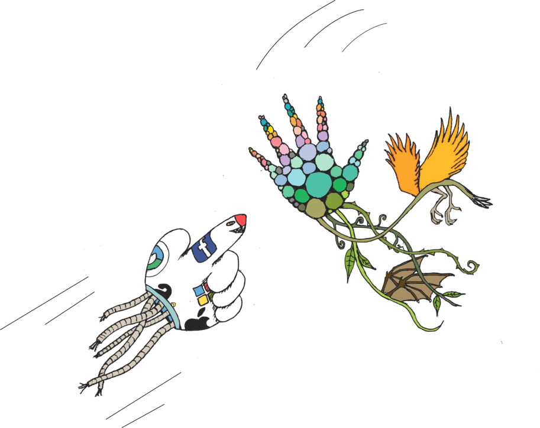

# Technologische soevereiniteit: Opnieuw leren houden van machines

***Alex Haché***

> De grote fluwelen bal voldoet aan de behoeften van een buurt of gemeenschap:
> Het is roze en erg leuk, maar het heeft geen genade. De mensen denken dat de bal
> het kwaad niet ziet, en dat zij veilig zullen zijn, maar ze weet het heel goed. Ze heeft
> het Uitgevonden. De bal rolt met veel gerommel. Ze heeft het uitgevonden. [^1]

Science fiction verhalen bouwen aan die mogelijke toekomst, *multiversen*, en over het algemeen bouwen ze voort op wat (nog) niet is gebeurd.
Telkens een "activist zich een wereld voorstelt waarvoor die wil strijden: een wereld zonder geweld, zonder kapitalisme, zonder racisme, zonder seksisme, zonder gevangenissen, enz. zorgt dat voor de ontwikkelen van een speculatieve fictie" [^2].
Narratieven die ons verenigen in onze kringen van affiniteiten en weerstand.
Narratieven die ons in staat stellen om "de machine" [^3] aan te vallen en er een uitweg naar buiten te zoeken.
Het gebruiken van ons vermogen om op een utopische manier over nieuwe werelden te speculeren, is een voorstel om ook samen na te denken over de *‘kwaadaardig’ elektronica, -internet, -mobiel telefoons en -satellieten*.

Reuzenballen van roze fluweel die je niet langer kunt negeren.
Het ontdekken van nieuwe vormen, het benoemen ervan, het dromen van andere, mogelijke technologieën.
Technologische soevereiniteit gaat vooruit omdat het tegelijkertijd verlangen, speculatieve fictie en alternatieve realiteiten vormt.

Een 45-jarige vader en zijn 20-jarige zoon.
Ze lijken een goede relatie te hebben.
De zoon vraagt aan zijn vader om hem te filmen met zijn mobiele 'telefoon', terwijl hij in de zee poseert.
Eerste poging, tweede, derde, vierde keer.
Het lukt de vader niet. De zoon blijft geduldig maar is verbaasd over zijn incompetentie.
Plotseling haalt de barst de vader uit.
Het strand is stil.
Ze roepen tegen elkaar over het wegvallen van vertrouwensrelaties, afkeer en angst voor 
mobiele telefoons en Facebook.
De zoon belooft zijn vader beter te begeleiden, zodat hij ook daar in bekwaam wordt. Het zal van hem een vreemdeling maken, hij die nog met tien vingers blind kan typen.
Bij analoge generaties met specifiek hersenvertakkingen, gebeurt het experimenten en leren nog in drie dimensies.
Door het gesprek voelde ik me vereenzaamd. Ik wilde ook deel zijn van het gesprek. Ik wenste dat dit soort uitbarstingen van boosheid vaker zouden voorkomen. In het verlengde hiervan zou ik zo graag meer mensen zien die met een pétanquebal iPhones van Apple Stores kapotslaan. [^4].

We zouden plaats moeten maken voor andere technologieën, iets beters dan wat we vandaag de dag "Informatie- en communicatietechnologie (ICT) noemen.
Een mobiele telefoon is een computer, de PC is reeds verouderde, tabletten met donkere schermen, horloges verbonden met het internet die uw stappen tellen terwijl je loopt, menstrueert en neukt.
Apparaten bevolkt door *apps* en "services" die ons onderschatten in onze intelligentie en onze waardigheid en kunnen ondergraven.
"Lang leven het kwaad, lang levend het kapitaal! *De doorgedraaide heks* [^5] als de incarnatie van het Cassandra syndroom [^6].

We moeten gesprekken durven aangaan met degenen die blijk geven van een minimaal begrip van hoe beangstigend de toekomst eruit zou zien waar machines de singulariteit hebben bereikt [^7].

We moeten de argumenten counteren die naar voren worden gebracht in onze gemeenschappen en collectieven; door vrienden; in onze netwerken van vertrouwen; en in parken, eetzalen en scholen; in sociale voorzieningen en ziekenhuizen. Argumenten als: ”het is toch zo praktisch en comfortabel", "er is geen alternatief", "ik heb niets te verbergen" en "wat doet het ertoe als ze ons controleren? Alles is toch al om zeep ".

Ons collectief bewustzijn wordt gevoed vanuit een schrijnend gebrek aan originaliteit waarvan de oorzaak is te vinden in het het neoliberaal discours dat bij elke nieuwe commerciële technologie onze geesten en verlangens verder inpalmt. 

We moeten het hier nu toch eens wat meer hebben over de psychologische, sociale, de politieke, ecologische en economische kosten die deze technologieën teweeg brengen.
En nee, dat gaat hier dus niet over de vrijheid om *selfies* te nemen in de Google, Amazon [^8], Facebook, Microsoft en Apple winkelcentra en nog maar eens uploaden van een foto op een *instashit* account; het gaat hier over repressie, controle, bewaking en kwantificering, en het in discrediet brengen van het leven en natuurlijke rijkdommen.
Om dit gesprek te voeren roepen we diegenen onder jullie op die worden uitgebuit, tot waanzin worden gedreven, tot zelfmoord plegen, of vermoord worden in de femicides in grensgebieden of in de Speciale Economische Zones, om een globaal dystopisch technologisch ecosysteem te voeden. [^9]

* * *

De technologische soevereiniteit (TS) die we willen, is er een die technologieën ontwerpt, ontwikkelt, verspreid en droomt die welzijn en welvaart biedt, die niet *meer* onrechtvaardigheid creëert of helpt in stand houden. Het is zoals de ethische en politieke revolutie in de beweging voor voedselsoevereiniteit die streeft naar de productie en consumptie van eerlijke en lokale voeding. Wat we kunnen leren van deze analogie van voedselsoevereiniteit versus technologische soevereiniteit is waar we het in het eerste deel over hebben gehad.

In deze bundel van artikelen worden nog meer voorbeelden van TS aangereikt die moeten worden begrepen als speculatieve fictie om sociale en politieke verandering teweeg te brengen. De verschillende bijdragen tonen de inherente spanningen die bestaan tussen autonomie en soevereiniteit, bijdrage en duurzaamheid, toe-eigening door kapitalisme vs. nieuwe feministische technologieën.

Toch zijn we onderweg twee belangrijke bijdragen kwijtgeraakt die niet in deze bundel terecht zijn gekomen.

Een artikel over excentrieke vormen van zelf-management van gezondheid, de dekolonisatie van ons lichaam en de technologische experimenten op het gebied van gezondheid, seksualiteit en zorg: TS kan niet alleen maar software of hardware zijn, maar het moet ook *wetware* zijn als ruimte voor kritiek, verzet en weerstand [^10] tegen het farmaceutisch-medisch-industrieel imperium.

We wilden ook nog verder ingaan op de weinig bekende geschiedenis van verschillende TS-visionairen. Uit nieuwsgierigheid en rebellie zijn ze erin geslaagd om internet te krijgen waar het niet gewenst was, om de apartheidsstaat aan te vallen door clandestiene communicatie aan te bieden, om te laten zien dat prachtige technologieën kunnen worden gecreëerd en aangepast aan hun omgeving

Voja Antonic [^11] (Joegoslavië), Roberto Verzola [^12] (Filipijnen), Onno Purb [^13] (Indonesië) en Tim Jenkin [^14] (Zuid-Afrika) zijn zeer vrijgevig geweest met ons in het delen van hun context, motivaties en inspiraties met ons. Deze hebben ons laten zien dat TS is samengesteld uit verschillende lagen, affiliaties en denkbeelden. De voetnoten spreken boekdelen in deze.

Tegenwoordig maakt iedereen gebruik van open source, waaronder een aantal grote bedrijven die zijn opgenomen in de Fortune 500, overheden, grote softwarebedrijven en start-ups. Delen, in plaats van het maken van eigen code, is goedkoper, gemakkelijker en efficiënter.  De meesten onder ons vinden het openen een softwaretoepassing vanzelfsprekend, net zoals we het vanzelfsprekend vinden dat de lichten aangaan. We denken nauwelijks nog na over het menselijk kapitaal dat nodig is om dit te laten gebeuren. De kosten van het niet ondersteunen van de huidige digitale infrastructuur zouden enorm zijn.

Het onderzoek, getiteld *Roads and Bridges* [^15], bestudeerd hoe grote bedrijven profiteren van de digitale commons en weinig of niets teruggeven.

In het vorige boek hebben we aangegeven dat deel uitmaken van de vrije software / open-source wereld niet genoeg was om TS te maken. Zo betekent deelname aan TS ook niet dat alle deelnemers samenwerken om bevrijdende technologieën te ontwikkelen. TS-initiatieven moeten meer rechtvaardige en duurzame gemeenschappen opbouwen, waar alle deelnemers weten hoe ze moeten omgaan met diversiteit, inclusie en met privileges en machtsdynamiek.

*De kokosrevolutie* [^16] en de *Ecologie van Vrijheid* van Murray Bookchin herinneren ons eraan dat toegeëigende technologieën diegene zijn die ontwikkeld worden in een gemeenschap die het niveau, of de graad, kiest van de technologieën die ze nodig heeft, en die rekening houdt met de ontwikkelingsprocessen en manieren om dingen te doen, om zo verder te gaan in de richting van bevrijdende technologieën

Met deze ambities benadrukken we nieuwe contexten waarin het concept van TS populair is geworden. De Framasoft-organisatie in Frankrijk heeft bijvoorbeeld een ambitieus actieplan ontwikkeld om het internet te *de-googlizen* [^17], en hun boek *Digitaal: terugnemen van controle* [^18] over verzetspraktijken die soevereiniteit, autonomie en nieuwe vormen van samenwerking combineren. 

In Catalonië hebben er enkele technologische soevereiniteitscongressen [^19]: *het Anti Mobile Congress* [^20] en het *Sociaal Mobiel Congres* [^21]. Deze evenementen vergroten het bewustzijn en creëren actie-netwerken om technologieën te ontwikkelen op basis van verschillende invalshoeken.

Het TS-concept is inmiddels ook overgenomen door een aantal openbare instellingen zoals *opstandige gemeenteraden* [^22] (Spanje). Het bevorderen van hybride vormen van maatschappelijk middenveld die meer steun bieden aan TS-initiatieven kan ofwel de alarmbellen doen rinkelen of aanleiding geven tot vreugde en een voortzetting van het verhaal.

Stelt u zich eens voor dat er overheidsgeld zou worden vrijgemaakt om onze digitale infrastructuur te onderhouden en bijvoorbeeld alternatieven aanbieden voor Google-services van niet-commerciële aard, waarbij gegevens decentraal worden gehost in systemen die het recht op privacy en encryptie standaard opnemen in hun ontwerp. Dit zou een gemeenschappelijk actiepunt kunnen zijn waarbij het openbaar bestuur en het maatschappelijk middenveld elkaar wederzijds zou kunnen ondersteunen.

Daarvoor moeten we meer steun bieden aan de kleine en middelgrote gemeenschappen die de geëigende technologieën en TS ontwikkelen, zodat ze technologieën kunnen blijven leveren aan de gemeenschappen die daar nood aan hebben. Technologieën die zo mooi en uniek zijn als kleurenpracht van vlindervleugels. Een krachtig voorbeeld daarvan is het werk van *Atelier Paysan* [^23] ("de werkplaats van de landbouwer"), een netwerk van boeren die jarenlang machines hebben ontworpen om het land en de velden te bewerken en hun ontwerpen en kennis uitwisselen.

Hoe dan ook, om deze allianties te laten functioneren, moeten de instellingen de minachting achterwege laten die ze voelen voor kleine initiatieven die basis TS ontwikkelen. Om TS te bereiken, moeten we een beroep doen op alle niveaus: de micro, de middenmoot en de macro.

De toekomst ziet er niet goed uit en daarom geloven we dat TS ons kan helpen het individualisme tegen te gaan waartoe we worden aangemoedigd door het wereldwijde kapitalisme.

Niemand zou zich alleen moeten voelen. Niemand zou het gevoel moeten hebben dat ze er alleen voor staan. Vrienden zijn terughoudend, gevoelens van angst nemen bezit van ons en de ruimte voor vrijheid krimpt. Tegelijkertijd komen ongerelateerde mensen samen in een koude, grijze ruimte, ter ondersteuning van een initiatief voor lokaal computergebruik. Ze proberen te doorgronden wat er aan de hand is, en willen praten met ons over technologieën, hun praktijken delen, vragen leren formuleren, en hun angsten laten varen. Dit gebeurt op veel plaatsen.

Er komen steeds meer berichten binnen van mensen die op zoek zijn naar manieren om online agressie aan te pakken. Ze hebben mijn webpagina verwijderd, de inhoud gecensureerd, lastiggevallen, beledigd, gechanteerd ... De aanvallen zijn onophoudelijk, flauw, gevaarlijk, creatief. Er is geen vrijheid van meningsuiting meer op internet. Er zijn alleen niveaus van privileges als het gaat om wie het het hardst te keer mag gaan.

Dit alles, zeiden we een paar maanden geleden tegen elkaar toen ik samen met een paar dierbare vrienden nadachten over hoe we het probleem van toegeëigende technologieën kunnen benaderen, als een weergalmende echo van de utopische horizon waar we naartoe willen. We willen nog steeds naar die plek gaan waar onbekende talen worden gesproken, vocabulaires die niet bestaan, grammatica's die niet met elkaar te rijmen zijn.

Om fenomenen te benoemen die nog niet onder ons zijn, maar die ons de weg alvast wijzen en die in eerste instantie onbevattelijk overkomen. Onze verhalen worden *speculatieve fictie*, en genereren zo ideeën en memes die door tijd&ruimte reizen waar uit een een alternatief technologisch ecosysteem kan ontstaan waarin we onze fundamentele rechten niet hoeven op te offeren: vrijheid, privacy, veiligheid, communicatie, informatie, expressie, samenwerking, solidariteit, vriendschap en liefde.

* * *

*"Een selffulfilling prophecy is een voorspelling die, eenmaal gemaakt, op zichzelf de oorzaak is van de verwezenlijking ervan."*

Ze voeden ons met dystopische toekomstbeelden: nieuws, series, films, boeken van de spektakelmaatschappij. Deze kruisen ons en verlammen ons, we zien alleen wazige beelden van gadget-technologieën. Maar, de context van die shitty toekomst is nu. Het betekent dat we worden verondersteld te geloven dat er maar één weg is. De weg waar we onze vrijheden moeten opofferen om een technologische machine te voeden die het heeft over *innovatie*, *creativiteit* en *participatie* maar haar macht vergroot om ons te kwantificeren, te atomiseren, in te delen in sociale groepen binnen patronen die geen normaal mens nog begrijpt. Afgeschermde algoritmen verpakt in zwarte dozen tonen steeds meer hun vermogen om ons te beïnvloeden.

De dystopie is voor velen gemakkelijk te ervaren en zijn perversiteit zit vervat in een mateloos gebrek aan verbeeldingskracht, evenals het potentieel om cultuur en voorstellingen van die negatieve toekomst te creëren: een toekomst van *meer* discriminatie, *meer* robotisering, *meer* onrechtvaardigheid op basis algoritmen, het zijn de nieuwe *wapens van math destruction*[^24]. De dystopie sluit ons op in een sierlijke feedback-loop van cynisme en het geloof dat technologieën zijn wat ze zijn en dat we ze niet kunnen veranderen. Het zijn selffulfilling prophecies en het is meer dan eens bewezen dat als we op het einde een beroep zouden doen op de Terminator [^25], dat hij op een dag ook effectief zal opdagen.

Intussen is het ook duidelijk dat het internet stervende is, het *wereldwijde web* krimpt. In mijn zelf-profetische utopische fictie openbaren zich werelden die zich via het elektromagnetische spectrum weer met elkaar verbinden, golven die om ons heen trillen en deel uitmaken van de commons. Mensen herdenken de technologische infrastructuren die ze nodig hebben, ze ontwikkelen ze, controleren ze, testen ze, onderhouden ze, transformeren ze en verbeteren ze.

Enkele jaren geleden populariseerden sommige bio-hackers het gebruik van bacteriën en sporenelementen voor het opslaan van digitale informatie. De wet van Moore niet meer geldig. Planned obsolesance (geplande veroudering) werd illegaal gemaakt. De cycli van oorlog, honger en onrecht veroorzaakt door de winning van mineralen en de massaproductie van technologieën, verdwenen geleidelijk. Op school genereren we intussen zelf onze coderings-sleutels: op de basisschool gebruikten we eerst verouderde technologieën zoals GPG, in de bovenbouw doen we een beroep op de uniek geluidsafdruk van onze eigen orgiastische uitspattingen. 

Ik kan mijn eigen algoritmische agent zodanig configureren, waardoor ik mijn gegevens deel met wie ik dat wil. De vrienden van mijn vrienden vormen een netwerk van netwerken van vertrouwen en affiniteiten; ideeën, middelen en behoeften komen vaker aan bod. Ik activeer mijn wind-, licht- en water ontvangers om alle schone energie te genereren die ik kan. Deze levensstijl vereist mijn frequente aanwezigheid buiten het scherm; Ik ben niet altijd verbonden. Er zijn geen technofoben meer of technofilie, omdat niemand nog al te veel waarde hecht aan technologieën. Technologie heeft terug de plek ingenomen die ze altijd heeft gehad.

En zo zijn er nog zoveel werelden te creëren. Om het vervreemdende kapitalisme te verslaan, moeten we ons toekomstbeelden leren voorstellen die niet dystopische zijn, toekomstbeelden waarbij het zelf creëerden van toegeëigende technologieën iets dagdagelijks en hopelijk iets banaals zal zijn.

[^1]: Speculative fictie workshop over feministische technologie, georganiseerd door Cooptecniques tijdens *Hack the Earth* in Calafou in 2017 (http://cooptecniques.net/taller-de-escritura-especulativa-tecnologias-feministas/)

[^2]: Octavia's Brood: *Science Fiction Stories from Social Justice Movements*, Walidah Imarisha, adrienne maree brown, editors.

[^3]: *Sal de la maquina. Superar la adicción a las nuevas tecnologías*, Sergio Legaz, author and Miguel Brieva, artist and member of the editorial council of *Libros en acción*.

[^4]: https://www.youtube.com/watch?v=vNWAFApQDIc

[^5]: Nvdv: La Bruja Avería ("De doorgedraaide heks") is een creatie uit een Spaanse kindertelevisie-reeks uit de jaren 80: *La Bola de Cristal* (De kristallen bal), waar met de regelmaat van de klok kritiek op elektronica en antikapitalistische slogans kwamen bovendrijven.

[^6]: https://www.youtube.com/watch?v=0jFpPN2xmSI

[^7]: https://es.wikipedia.org/wiki/Singularidad_tecnol%C3%B3gica

[^8]: Amazonians speak about .amazon, https://bestbits.net/amazon/

[^9]: Foxconn, The Machine is Your Lord and Your Master, https://agone.org/centmillesignes/lamachineesttonseigneurettonmaitre/

[^10]: https://gynepunk.hotglue.me/

[^11]: https://en.wikipedia.org/wiki/Voja_Antoni%C4%87, https://archive.org/details/20140418VojaAntonicTalkHackTheBiblioCalafou, https://hackaday.io/projects/hacker/65061, https://twitter.com/voja_antonic 

[^12]: https://rverzola.wordpress.com, https://wiki.p2pfoundation.net/Roberto_Verzola

[^13]: http://www.eldiario.es/hojaderouter/internet/Onno_W-_Purbo-wokbolic-wajanbolic-internet-wifi_0_520048966.html, https://twitter.com/onnowpurbo, https://www.youtube.com/watch?v=b_7c_XDmySw, Wokbolik, what's that?

[^14]: Tim Jenkin: *Talking to Vula: The Story of the Secret Underground Communications Network of Operation Vula,* 1995.
*The Vula Connection*, documentary film about the story of Operation Vula, 2014: https://www.youtube.com/watch?v=zSOTVfNe54A , Escape from Pretoria Prison: https://www.youtube.com/watch?v=0WyeAaYjlxE

[^15]: Nadia Eghbal: *Road and Bridges – The Unseen Labor Behind Our Digital Infrastructure*, Ford Foundation, 2016: https://fordfoundcontent.blob.core.windows.net/media/2976/roads-and-bridges-the-unseen-labor-behind-our-digital-infrastructure.pdf

[^16]: https://en.wikipedia.org/wiki/The_Coconut_Revolution

[^17]: https://degooglisons-internet.org

[^18]: https://framabook.org/docs/NRC/Numerique_ReprendreLeControle_CC-By_impress.pdf

[^19]: http://sobtec.cat/

[^20]: http://antimwc.alscarrers.org/

[^21]: http://www.setem.org/blog/cat/catalunya/mobile-social-congress-2017-28-de-febrer-i-1-de-marc

[^22]: https://bits.city/

[^23]: http://latelierpaysan.org/Plans-et-Tutoriels

[^24]: Cathy O'Neil: *Weapons of Math Destruction: How Big Data Increases Inequality and Threatens Democracy*, 2016.

[^25]: http://terminatorstudies.org/map/
