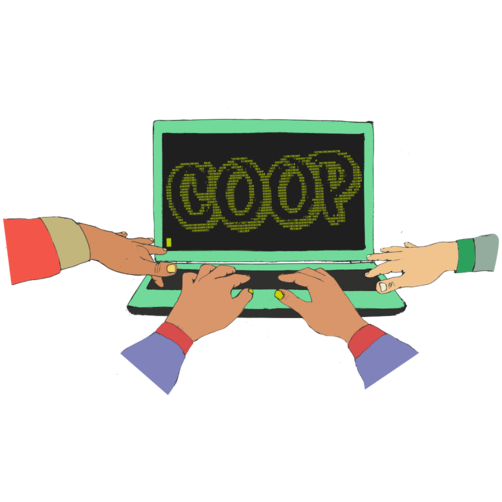

# Hacklabs to technological cooperatives

***Carolina***

Techno-political collectives mix technical and political concerns.  A perfect
example is Riseup which defines its mission as a provider of “online
communication tools for people and groups working on liberatory social change.
We are a project to create democratic alternatives and practice
self-determination by controlling our own secure means of communications”.
Nowadays the field is composed by very different types of organizations
ranging from loose and informal networks of hacktivists, free software
communities, formal organisations such as foundations, start-ups invested in
the so-called civic tech and even public institutions and council towns.

Some years ago, technological sovereignty meant the development of free
technologies [^0] by and for the civil society.  Empowering society by
developing tools, hardware, services and infrastructure that meet social needs
based on the ethics of free software and self-management.  Nowadays, with the
transition to open source things have become messy as big corporations
promoting open source software basically for their own benefit have broken the
relation between technological development and social responsibility.

In this text I will rethink what role cooperatives have, or could have, as
economic and social actors in reclaiming this relationship.  To do so, I will
depart from the broad galaxy of techno-political collectives [^1], and then
focus on the format of technological cooperatives as they have been deployed
in Spain.

## A galaxy of initiatives

We find foundations which can be committed to create open source and free
software solutions and services (FSF, Mozilla, Blender, etc.) and/or to
protect and defend digital rights (Electronic Frontier Foundation, La
Quadrature du Net, X-net) mobilizing and pulling economic resources to make
those project run in the mid and long term.  People can support foundations as
a donor, volunteer, intern.  They normally look for experienced and qualified
professionals and count with formal and legal structures when many
techno-political collectives are based on informal groups and communities.

Another weird aspect of the current scene consists in local government
initiatives which are working towards openness and transparency based on
citizen participation.  Many “rebellious” council towns located in Spain are
supporting the development of free software tools focused on citizen driven
political participation [^2], and behind those developments, freelancers, small
companies and cooperatives are working on setting up viable, robust and
trustful systems to promote open democracy.

Technological cooperatives can be found at the intersection of both previous
options as they have an economical goal aiming towards sustainability and also
a political and social approach to technology.  Besides, as most of their
clients come from the third sector (non‐profit oriented, such as NGOs,
associations, collectives ) they can help build products based on their
specific needs and desires.  Examples include [^3] Candela (Amnesty’s activist
management app), GONG (project/budget manager for NGOs), Oigame (online
petition platform), Nolotiro (platform to exchange things), Mecambio
(repository of energetic, financing and connectivity alternatives).

## Creating a coop...
  
From now on, I will focus on the particular story of how we founded a free
software cooperative, Dabne, in Spain – but simultaneously others were doing
the same [^4].  In the 90’s, when Internet started to be accessible, several
projects [^5] wonder what it meant to escape from established identities,
self-organize online transgressing borders, create a collective brain.
Hacklabs, in squats or association offices, were places to experiment, learn
about things that were not easily available as not everyone had an Internet
access yet, nor a computer.  Until then hackers were barely visible and
hacklabs became that meeting point where “isolated” hackers came in contact
with social movements.  A passionate hybrid came out of that, it knock a
strong free/libre software community which had a high impact on society’s
approach to free technology.

Spain has quite a long tradition of agricultural and industrial cooperatives
and at some point, some of us started thinking that our hobby could turn
through cooperativism into a way of living.  As each cooperative have their
own agreements regarding work and labour, I will share the terms under which we
founded our own:

 * We wanted to make a living but not at all costs.
 * We wanted a shared decision making process.
 * We wanted transparency.
 * We wanted to define our goals, and change them when needed.
 * We wanted everybody to be treated equal and in a fair way.
 * We wanted to continue learning, have fun and promote free software.
 * We didn’t want to be slaves of our work but work with others in a
   collaborative and cooperative way.

With that in mind, we analysed how the “enterprise world” worked and wonder if
we could become “business people” doing something that until then we did for
free.  A key element lied in the belief that we were going to found companies
and step into “the market”, that thing governed by capitalist rules which we
were deeply against.  Vertigo.  There were no previous references of free
technology cooperatives neither money to invest (we needed 250€ each).  There
was a strong determination and will to not work for big capitalist companies
that make you uniform, dull and slave to their rules.  The libre/free software
community was there so we were not alone, we had our computers and skills, our
beliefs that free technologies empower society, that free software brings
sovereignty and that the digital era should make knowledge accessible, open
doors to people and bring democratic alternatives to societies.  We were
choosing a way of living not just a job.

Dabne was founded in 2005 and it took us one year to understand what it meant
to create a company, to manage a business and to decide a legal form that
would favour our values of collaboration, transparency and responsibility.  We
went to workshops, talks, trainings, wrote business plans, attend appointments
at the Chamber of Commerce.  It seemed endless but little by little things
began to take shape.

Becoming a coop happens in a specific environment of cooperatives advisers
which is by far more friendly and easy to ask than in the start up world for
instance.  Mantras like “success”, “fame”, “competitiveness”,“big profit” are
not part of their vocabulary.  They gave us a social approach, an
understanding of how to address our impact and empower social organisations in
the technical aspect.

Our friends xsto.info had founded one year before a free software cooperative
in Madrid, they were a small group of sysadmins, web developers, wireless
experts also committed to the free software community.  Their experience
helped us, we could share our doubts, difficulties, and see how others had
gone through similar situations.

All in all, we managed to set up the company, and one good thing about
software is that to start up, you basically need nothing but knowledge, a
laptop and Internet access which means that costs are minimum – but the first
challenge is to get the first clients.  Through friends and contacts, we
started our way, then the word spread mouth to mouth and slowly we had our
group of clients.

Our mainly technical profile made us look for alliances like with noez.org
focused on design and innovation centred on people.  With them we could share
different perspectives of technologies and made our work more understandable.
Then Dabne became in an unplanned way a women's free software cooperative.  So
far we do not know of any other women’s software development cooperative in
Spain.  This led Dabne to IT counselling: as active listeners we could make
technologies comprehensible to non-technical people, adjust projects rhythms,
be honest and able to say no when we cannot do it. 
 
## Building a multi-verse of communities and networks

Cooperatives are most of the times fragile.  But by working together, building
and taking part in existing communities, creating and nurturing networks, they
can strengthen their resilience and sustainability over time.

Through a cooperatives’ platform (UMCTA) we got in contact with environmental,
agroecology, social work and social adviser cooperatives willing to share
their longer experience and knowledge.  To become a coop also meant to enter
the social and solidarity economy community [^6].  At that time Coop57-Madrid,
an ethical financial service cooperative was founded and its goal has been to
finance social and solidarity economy projects thanks to investments from
civil society.  Red de economía alternativa y solidaria (REAS) and the social
market are networks for the production and distribution of goods and services
based on the principles of social and solidarity economy.  Among those we
found ones concerned with social transformation, environmental sustainability,
commons, gender equality, transparency, participation, self-organization,
internal democracy.

Interestingly, most social and solidarity economy networks share a lack of
interest towards techno-political issues, making difficult to include the
concerns of free software cooperatives in their agenda.  Because of this, in
2007 technical cooperatives set up the initiative “Software libre y ONGs”,
dedicated to promoting the use of free software and free technologies.  A call
for breakfasts while having short talks complemented with a conference focused
on Free/Libre software and Third sector organizations.  At a bigger scale, in
2008, the Federal Association of Free software companies (Asolif) and other
platforms [^7] were created for promoting free software, create new business
models and achieve responsible wealth.

On the other hand, communities were built around each specific technology,
programming language, content management system, operating system distribution
or hardware, in order to advance knowledge, share good practices, come up with
improvements, and welcome newbies.  A small cooperative uses several
technologies, so the best option would be to participate in the different
technical communities and attend their events (conferences, meet-ups, etc).
But being able to take part of IT community events requires people, time and
money, which is very difficult to handle in a small cooperative with limited
resources...

Yet, time has shown that new people are founding cooperatives and collectives
[^8] around free technology, so the wheel keeps rolling.

## SWOT for coop

I will recap dimensions introduced previously using a Strength Weakness
Opportunities Threats (SWOT) analysis where:

**Strengths** refers to characteristics and internal factors of the cooperative or
project that give it an advantage over others:

 * Small team can change and adapt quickly
 * Flexible working environment (home, office, client’s office)
 * Ability to make decisions and define company goals
 * No initial capital needed
 * Define own timing
 * Good corporate image
 * Creativity
 * Curiosity
 * Have fun

**Weaknesses** refers to characteristics of the cooperative or project that puts
it at a disadvantage relative to others:

 * Strain of working
 * 24/7 involvement
 * No business management experience
 * No specialized profiles
 * Difficulty to grow
 * Communication
 * No financial cushion
 * No legal counselling

**Opportunities** refers to external factors of the environment that the
cooperative or project could exploit to its advantage:

 * Able to develop own ideas & projects
 * Ability to chose partners & projects
 * Be part of different networks & communities
 * Capacity to respond to concrete and uncommon needs and desires

**Threats** are external elements in the environment that could cause trouble for
the cooperative or project:

 * Exhaustion and burn out
 * Uncertainty about future
 * No update on technical issues
 * Price reduction

## Now some open questions remain

Cooperatives can make possible the building of new autonomous zones while
responding to many challenges:

 * **Economy**: how to shape an economy of the commons, social and supportive?

 * **Self-organization**: how to be sustainable in a long term run, while
   questioning unquestionable truths like, consensus, horizontality,
   participation, leadership?

 * **Technological freedom**: how to fight for free software, digital rights,
   open knowledge and copyleft?

As years pass by, technological cooperatives still looks like a small field
based on strong personal relationships, which are key to building trust and
assuming new challenges, but that can be also a limitation when there is a
need to scale up.  Besides, the precarious and uncertain economic situation
makes it difficult to integrate new people.  However, there is always a moment
when the project grows and with it, should the team grow, how … or not?

Then who should be part of the cooperative?  Should they have specific
technical skills?  Should they have a versatile profile?  Are technical skills
always needed?  Is it affordable and ethical to have apprenticeships?

And what about decision making processes?  Cooperativism is about sharing the
decision making process but experience shows that not everyone wants to take
part of it – should they be excluded from the cooperative?  Is the ability to
make decisions key to be part of a cooperative?  Should all decisions be taken
in common?

These challenges give a comprehensible vision of the times to come, and the
creation of these autonomous zones opens possibilities to different ways of
understanding work, the commons, sustainability and economy.

[^0]: As a reminder, free technologies, in a nutshell, are the technologies and services based on the freedom given by free/libre software and it’s philosophy.  **Freedom 0**: The freedom to run the program for any purpose.  **Freedom 1**: The freedom to study how the program works, and change it to make it do what you wish.  **Freedom 2**: The freedom to redistribute and make copies so you can help your neighbour.  **Freedom 3**: The freedom to improve the program, and release your improvements (and modified versions in general) to the public, so that the whole community benefits.

[^1]: Rise Up: https://riseup.net/ (USA) • Autistici: https://autistici.org/ (ITA) • Free: https://www.free.de/ (GER) • So36: https://so36.net/ (GER) • BOUM: https://www.boum.org/ (FR)  • Nodo50: http://nodo50.org/ (ESP) • Pangea: https://pangea.org/ (ESP) • Immerda: https://www.immerda.ch/ (CH) • Mayfirst/People Link: https://mayfirst.org/ (USA)

[^2]: Consul: https://github.com/AyuntamientoMadrid/consul • Decidim: https://github.com/AjuntamentdeBarcelona/decidim

[^3]: Candela: https://github.com/amnesty/candela • Gong: https://gong.org.es/projects/gor • Oigame: https://github.com/alabs/oigame • Nolotiro: https://github.com/alabs/nolotiro.org • Mecambio: https://www.mecambio.net/

[^4]: Dabne: https://dabne.net/ • Xsto.info: https://xsto.info/ • aLabs: https://alabs.org/ • Semilla del software libre: https://semillasl.net/ • Enreda: https://enreda.coop/ • Gnoxys: https://gnoxys.net/ • Cooperativa Jamgo: https://jamgo.coop/

[^5]: **Quelques projets**: Sindominio: https://sindominio.net/ (ES) • Autistici: https://autistici.org/ (IT) • Samizdat: https://samizdat.net/ (FR) • Espora: https://espora.org/ (MX) • Thing: https://thing.net/ (USA)

[^6]: Redes Cooperativa: https://redescooperativa.com/intervencion-social/ • REAS: https://www.economiasolidaria.org/red_redes • Coop 57: https://coop57.coop/ • Economia Solidaria: https://www.economiasolidaria.org • Madrid Mercado Social: https://madrid.mercadosocial.net/ • Tangente coop: https://tangente.coop/

[^7]: Asolif: https://www.asolif.es/ • Esle: https://esle.eus/ • Olatukoop: https://olatukoop.net

[^8]: **Some other cooperatives, groups or initiatives working around free/libre technologies:** • Deconstruyendo: https://deconstruyendo.net/ • Interzonas: https://interzonas.info • Talaios: https://talaios.net/ • Shareweb: https://shareweb.es • Reciclanet: https://www.reciclanet.org • Buenaventura; https://www.buenaventura.cc/ • Itaca: https://www.itacaswl.com • Saregune: https://www.saregune.net • Cooptecniques: https://cooptecniques.net/ • **Latin America**: Kefir: https://kefir.red/ • Vedetas: vedetas.org • Tierra comun: https://tierracomun.org/ • Técnicas rudas: https://www.tecnicasrudas.org/
